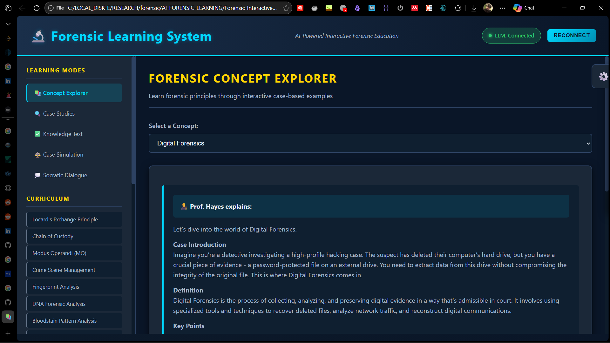
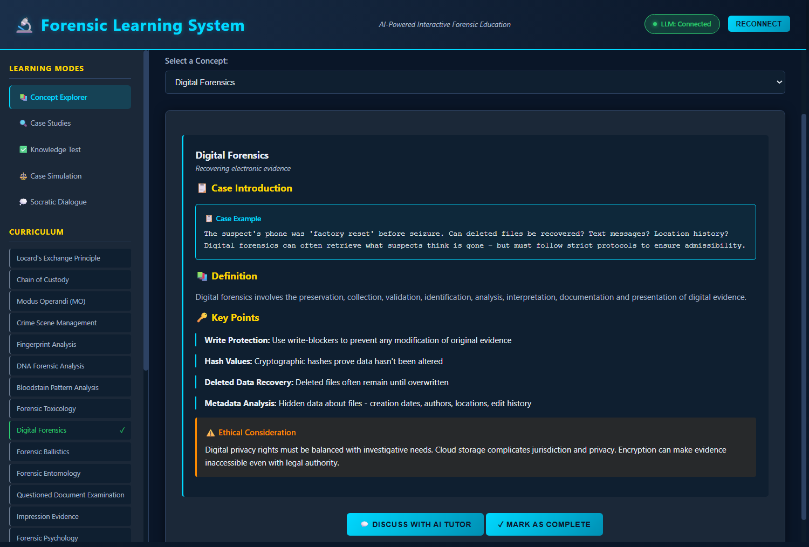
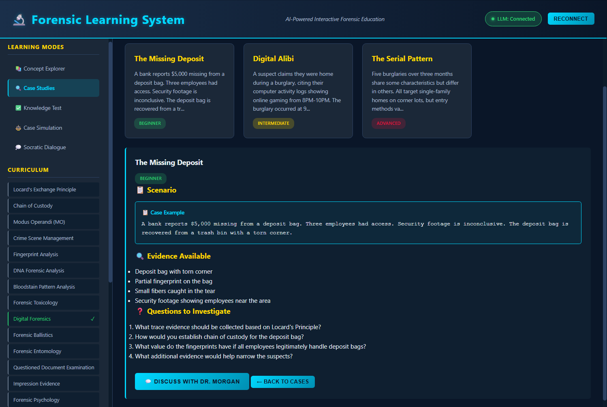
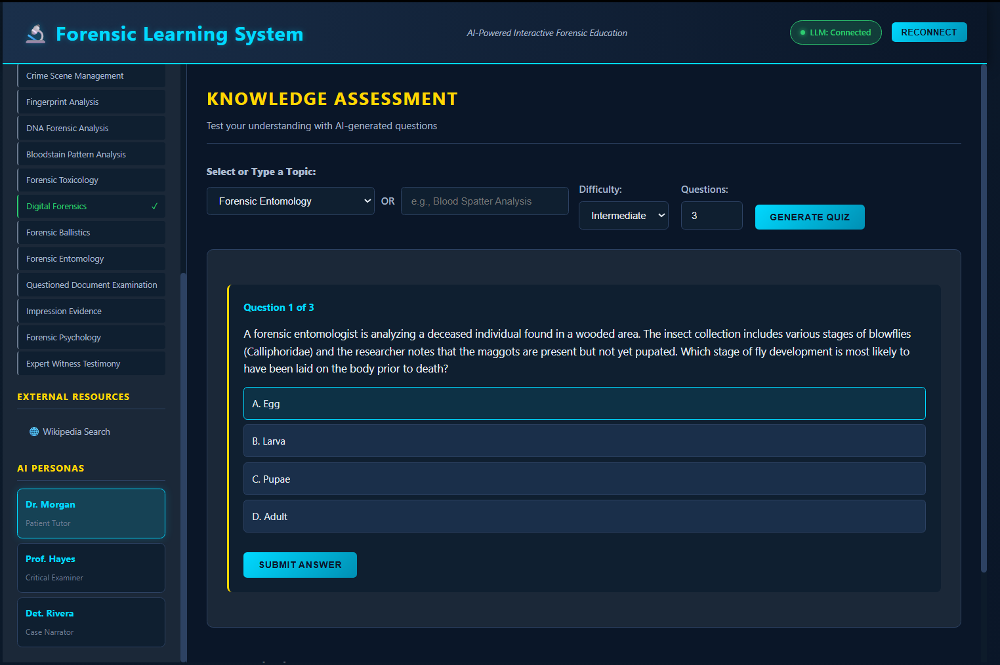
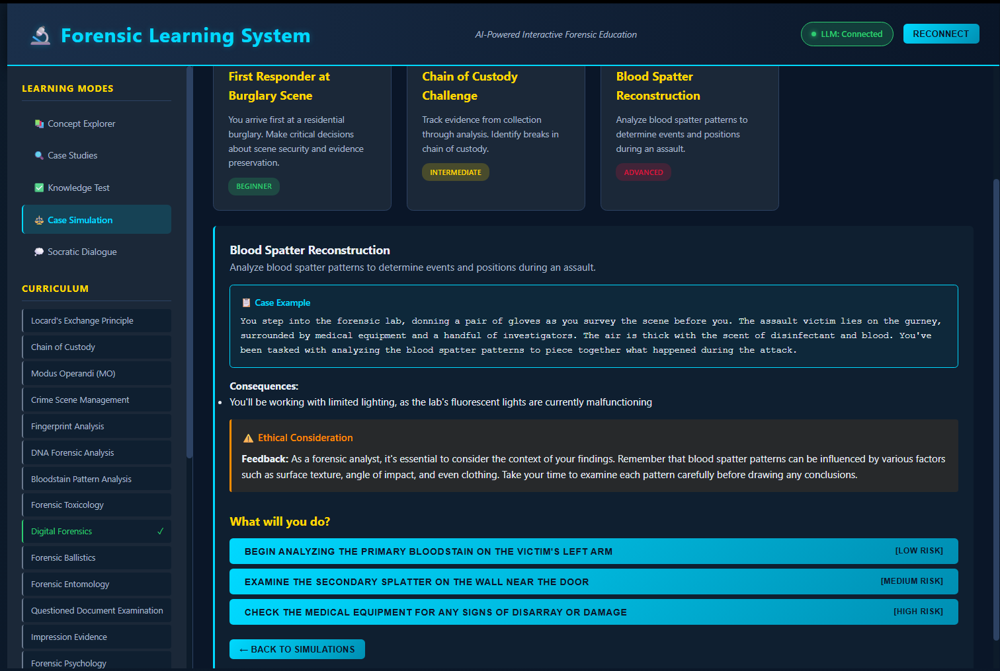
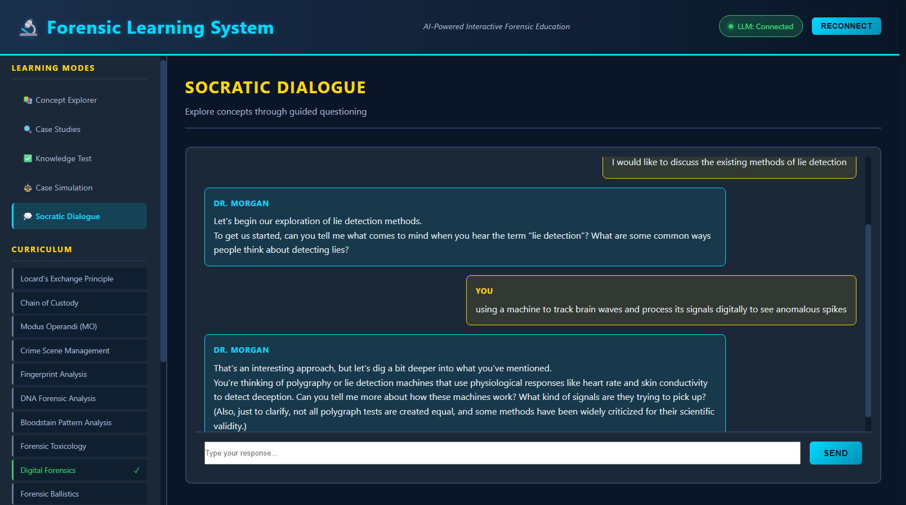

# Forensic Learning System - Interactive AI-Powered Education

## 📚 Overview

This is an **offline-first, AI-powered interactive learning system** designed specifically for forensic science and criminology students. Unlike Wikipedia or general-purpose AI chatbots, this system provides:

- **Case-based pedagogy** instead of rote definitions
- **Socratic questioning** to develop critical thinking
- **Adaptive explanations** that adjust to student level
- **Ethical framework** emphasizing responsibility and limitations
- **Interactive simulations** for hands-on learning
- **Local LLM integration** (LLaMA 3.2 via Ollama) for privacy and offline access



---

## 🎯 Key Differentiators from Wikipedia and ChatGPT

### vs. Wikipedia
| Feature | Wikipedia | Forensic Learning System |
|---------|-----------|-------------------------|
| **Teaching Method** | Static reference | Active, case-based learning |
| **Interaction** | Passive reading | Socratic dialogue, quizzes, simulations |
| **Adaptation** | One-size-fits-all | Adjusts to student level and progress |
| **Assessment** | None | Built-in quizzes and practice scenarios |
| **Context** | General encyclopedia | Forensic-specific with ethical considerations |
| **Learning Path** | User navigates randomly | Structured curriculum with progression tracking |

### vs. ChatGPT (General AI)
| Feature | ChatGPT | Forensic Learning System |
|---------|---------|-------------------------|
| **Persona** | Generic assistant | Three specialized teaching personas (tutor, examiner, narrator) |
| **Privacy** | Cloud-based, data collected | Fully offline with local LLM |
| **Curriculum** | No structure | 15-concept curated curriculum |
| **Pedagogy** | Answers questions | Teaches through cases, asks questions, guides discovery |
| **Assessment** | No built-in testing | Integrated quizzes and simulations |
| **Domain Focus** | General knowledge | Forensic science with ethical/legal nuance |
| **Progress Tracking** | None (in free version) | Tracks completion, quiz scores, skill development |

---

## 🧠 Pedagogical Design

### 1. **Case-Based Learning**
Every concept begins with a realistic scenario:
```
❌ BAD (Rote Definition):
"Locard's Principle states that every contact leaves a trace."

✅ GOOD (Case-Based):
"Detective Chen examines a break-in scene. The window is shattered, 
but there's no suspect. She notices tiny fabric fibers caught on 
a jagged edge. On the floor, soil particles that don't match the 
local terrain. These traces will become crucial evidence..."
```

**Why:** Students remember stories, not definitions. Cases provide context and relevance.

### 2. **Socratic Questioning**
Instead of telling answers, the system asks probing questions:
```
User: "DNA evidence proves guilt."

Examiner (Prof. Hayes):
"Let's examine that claim. If someone's DNA is found at a scene, 
what alternative explanations might exist besides their direct 
involvement? Consider how DNA might be transferred innocently."
```

**Why:** Develops critical thinking and exposes faulty assumptions—essential for forensic professionals.

### 3. **Three AI Teaching Personas**

#### 👨‍🏫 Dr. Morgan (Patient Tutor)
- **Role:** Supportive educator
- **Style:** Breaks down complex concepts, uses analogies
- **Tone:** Encouraging, warm, thorough
- **When to use:** Learning new concepts, struggling with material

#### 👨‍⚖️ Prof. Hayes (Critical Examiner)
- **Role:** Rigorous evaluator
- **Style:** Socratic questioning, challenges assumptions
- **Tone:** Direct, analytical, exacting
- **When to use:** Testing understanding, preparing for exams, developing rigor

#### 🔍 Det. Rivera (Case Narrator)
- **Role:** Experienced investigator
- **Style:** Storytelling, realistic scenarios
- **Tone:** Engaging, practical, experiential
- **When to use:** Understanding real-world application, seeing complexity

**Why Multiple Personas:** Different learning moments require different approaches. A struggling student needs patience; an advanced student needs challenge; understanding real-world complexity needs narrative.

### 4. **Adaptive Difficulty**
The system tracks:
- Concepts viewed and completed
- Quiz performance
- Response patterns

Based on this, it adjusts:
- Vocabulary complexity
- Amount of scaffolding
- Depth of explanation
- Challenge level of questions

### 5. **Ethical Framework**
Every concept includes:
- **Limitations:** What the science can't do
- **Uncertainties:** Error rates, unknowns
- **Ethical considerations:** Impact on justice, bias risks
- **Cautious language:** "suggests" not "proves"

**Why:** Forensic work has real consequences. Students must understand scientific humility.

---

## 🏗️ System Architecture

### Knowledge Structure

```
ForensicKnowledge = {
    curriculum: [
        // 15 core concepts organized by:
        // - category (foundational, procedural, biological, etc.)
        // - difficulty (beginner, intermediate, advanced)
        // - keywords for search/linking
    ],
    
    concepts: {
        'concept-id': {
            name: "Concept Name",
            tagline: "One-line summary",
            caseIntroduction: "Scenario-based intro",
            definition: "Clear definition",
            keyPoints: [/* Structured teaching points */],
            realWorldApplication: [/* Use cases */],
            limitations: [/* What it can't do */],
            ethicalConsiderations: "Ethical discussion",
            socraticQuestions: [/* Reflection prompts */],
            casePractice: {/* Practice scenarios */}
        }
    },
    
    caseStudies: [/* Interactive case investigations */],
    simulations: [/* Hands-on scenarios */]
}
```

**Knowledge vs. Reasoning:**
- **Structured Knowledge:** Core facts, definitions, procedures stored as data
- **AI Reasoning:** LLM generates explanations, questions, feedback dynamically
- **Hybrid Approach:** Static content ensures accuracy; AI provides adaptation and interaction

### AI Persona System

Each persona has:
- **System Prompt:** Detailed teaching philosophy and constraints
- **Prompt Generator:** Context-aware prompt construction
- **Response Formatter:** Consistent output structure

```javascript
AIPersonas.generateConceptExplanationPrompt(concept, userLevel, persona)
// Returns: Specialized prompt for LLM that includes:
// - Persona's teaching style
// - User's current level
// - Required structure (case intro, definition, key points, etc.)
// - Ethical constraints (cautious language, acknowledge limits)
```

### Learning Modes

1. **Concept Explorer**
   - Structured content delivery
   - AI-enhanced explanations
   - Progress tracking



2. **Case Studies**
   - Multi-evidence scenarios
   - Guided analysis
   - AI discussion partner



3. **Knowledge Test**
   - AI-generated quizzes
   - Adaptive difficulty
   - Immediate feedback with explanations



4. **Case Simulation**
   - Branching scenarios
   - Consequence modeling
   - Forensic decision-making practice



5. **Socratic Dialogue**
   - Free-form exploration
   - Guided discovery
   - Critical thinking development



---

## 💻 Technical Implementation

### Stack
- **Frontend:** HTML5, CSS3, Vanilla JavaScript (no dependencies)
- **AI Engine:** LLaMA 3.2 via Ollama API
- **Storage:** LocalStorage for progress tracking
- **Architecture:** Client-side only (fully offline capable)

### Ollama Integration

```javascript
// Connection test
await OllamaInterface.testConnection()
// Returns: { success: true, models: [...] }

// Generate response
await OllamaInterface.generate(prompt, {
    temperature: 0.7,  // Creativity level
    maxTokens: 2000    // Response length
})
// Returns: { success: true, response: "..." }

// Streaming for long responses
await OllamaInterface.generateStream(prompt, onChunk)
```

### Why LLaMA 3.2 (Local)?
1. **Privacy:** Sensitive forensic education stays on device
2. **Offline:** Works without internet once model downloaded
3. **Cost:** No API fees for students
4. **Customization:** Can fine-tune for forensic domain
5. **Speed:** Local inference faster than cloud for short responses

---

## 📖 MVP Curriculum (15 Core Concepts)

### Foundational (3)
1. **Locard's Exchange Principle** - Every contact leaves a trace
2. **Chain of Custody** - Evidence integrity and documentation
3. **Crime Scene Management** - Preservation and processing

### Procedural (2)
4. **Modus Operandi** - Criminal behavior patterns
5. **Impression Evidence** - Tracks, marks, and traces

### Physical Evidence (3)
6. **Fingerprint Analysis** - Uniqueness in friction ridges
7. **Ballistics** - Firearms and ammunition examination
8. **Bloodstain Pattern Analysis** - Physics of blood distribution

### Biological Evidence (3)
9. **DNA Forensic Analysis** - Molecular identification
10. **Forensic Toxicology** - Drugs, poisons, and chemicals
11. **Forensic Entomology** - Insects as witnesses

### Digital/Documents (2)
12. **Digital Forensics** - Electronic evidence recovery
13. **Questioned Document Examination** - Forgery and authentication

### Behavioral/Legal (2)
14. **Forensic Psychology** - Criminal behavior and competency
15. **Expert Witness Testimony** - Science in the courtroom

**Progression:**
- Beginner → Foundational concepts and procedures
- Intermediate → Physical and biological evidence
- Advanced → Digital, behavioral, and legal aspects

---

## 🎓 Usage Instructions

### Setup

1. **Install Ollama:**
   ```bash
   # Download from https://ollama.ai
   curl -fsSL https://ollama.com/install.sh | sh
   ```

2. **Download LLaMA 3.2:**
   ```bash
   ollama pull llama3.2
   ```

3. **Start Ollama:**
   ```bash
   ollama serve
   ```

4. **Open the System:**
   - Open `forensic-learning-system.html` in a web browser
   - Click "Connect to Ollama"
   - Verify connection status shows "Connected"

### Learning Workflow

#### For New Students (Beginner)
1. Start with **Locard's Principle** (concept explorer)
2. Read the case introduction
3. Use **Dr. Morgan** (patient tutor) for explanations
4. Complete the practice scenario
5. Take a beginner-level quiz
6. Move to **Chain of Custody**
7. Try a case study combining both concepts

#### For Intermediate Students
1. Select intermediate concepts (Fingerprints, DNA, MO)
2. Use **Prof. Hayes** (critical examiner) to challenge understanding
3. Attempt intermediate case studies
4. Practice with simulations
5. Engage in Socratic dialogue on ethical issues

#### For Advanced Students
1. Focus on complex concepts (Toxicology, Expert Testimony)
2. Use **Det. Rivera** (case narrator) for real-world scenarios
3. Attempt advanced simulations
4. Generate advanced quizzes
5. Discuss controversies and limitations

### Customization

**Settings Panel (⚙️ button):**
- **Ollama URL:** Change if running Ollama remotely
- **Model:** Switch to different LLaMA versions or models
- **Temperature:** Adjust AI creativity (0.0 = precise, 1.0 = creative)

**User Preferences:**
- System tracks progress automatically
- Quiz history saved locally
- Concept completion status persists

---

## 🔬 Educational Design Principles

### 1. **Uncertainty Emphasis**
Forensic science is not CSI magic. The system consistently:
- Uses cautious language ("suggests", "indicates", "may")
- Discusses error rates and limitations
- Presents alternative explanations
- Acknowledges when science can't provide answers

### 2. **Ethical Integration**
Every concept includes:
- Real consequences of errors
- Bias and tunnel vision risks
- Constitutional and legal responsibilities
- Human impact of forensic work

### 3. **Critical Thinking Over Memorization**
Instead of:
```
Q: What is Locard's Principle?
A: Every contact leaves a trace.
```

The system asks:
```
Q: If a suspect's fiber is found at a scene, what alternative 
   explanations might exist besides direct involvement?
   
Q: Why might the ABSENCE of trace evidence be as significant 
   as its presence?
```

### 4. **Misconception Addressing**
The system explicitly confronts:
- "DNA proves guilt" → DNA shows presence, not intent
- "Fingerprints are infallible" → Examiners have made errors
- "Bloodstain analysis is precise science" → Limited validation studies
- "Bite marks identify people" → Largely discredited

### 5. **Real-World Complexity**
Simulations include:
- Resource constraints (time, budget)
- Ambiguous evidence
- Conflicting expert opinions
- Ethical dilemmas with no clear answers
- Political and media pressure

---

## 🆚 Comparative Analysis

### When to Use This System vs. Alternatives

**Use Forensic Learning System when:**
- Learning forensic science fundamentals
- Preparing for exams or certification
- Developing critical thinking about evidence
- Practicing case analysis
- Understanding ethical responsibilities
- Need offline access
- Want structured progression

**Use Wikipedia when:**
- Quick reference lookup
- Exploring related topics broadly
- Verifying basic definitions
- Historical context
- Linking to primary sources

**Use ChatGPT/Claude when:**
- General conversation
- Non-forensic topics
- Creative writing
- Brainstorming
- Don't need forensic-specific pedagogy

**Use Forensic Textbooks when:**
- Deep technical detail (chemistry, biology)
- Laboratory procedures
- Legal case law
- Comprehensive reference

**Ideal Combination:**
1. Learn concept with **Forensic Learning System**
2. Practice with system's cases and quizzes
3. Verify with **Wikipedia** and primary sources
4. Deep dive with **textbooks** for technical detail
5. Discuss edge cases with **ChatGPT/Claude**

---

## 🚀 Future Enhancements

### Planned Features
1. **Fine-tuned Model:** Domain-specific LLM trained on forensic literature
2. **Multimedia Integration:** Embed crime scene photos, lab videos
3. **Peer Discussion:** Local network mode for classroom use
4. **Lab Simulations:** Virtual evidence processing
5. **Case Library:** Expanded real (anonymized) case studies
6. **Assessment Analytics:** Detailed progress reports
7. **Certification Prep:** Exam-style comprehensive testing
8. **Expert Interviews:** Recorded Q&A with professionals

### Advanced AI Features
1. **Adaptive Curriculum:** AI reorders concepts based on struggle areas
2. **Personalized Examples:** Generate cases matching student interests
3. **Error Pattern Analysis:** Identify conceptual gaps from quiz mistakes
4. **Debate Mode:** AI takes opposing viewpoint for argument practice
5. **Research Assistant:** Help explore forensic literature

---

## 📊 Learning Outcomes

After completing this curriculum, students should be able to:

### Knowledge
- Define core forensic concepts with appropriate caveats
- Explain evidence types and their limitations
- Describe proper evidence handling procedures
- Understand legal admissibility standards

### Skills
- Analyze crime scenes systematically
- Evaluate evidence critically (not accepting at face value)
- Identify alternative explanations for findings
- Recognize cognitive biases in investigations

### Attitudes
- Scientific humility (acknowledging uncertainty)
- Ethical awareness (impact on justice)
- Critical thinking (questioning assumptions)
- Professional responsibility (duty to accuracy)

---

## 🛠️ Troubleshooting

### "LLM: Disconnected" Status
1. Ensure Ollama is installed and running: `ollama serve`
2. Check model is downloaded: `ollama list`
3. Verify URL in settings: default is `http://localhost:11434`
4. Check firewall isn't blocking port 11434

### AI Responses Are Slow
1. Reduce temperature in settings
2. Use smaller model (llama3.2:1b instead of llama3.2:3b)
3. Ensure system has adequate RAM (8GB+ recommended)
4. Close other applications

### Responses Don't Match Expected Format
1. Increase temperature slightly (0.6-0.8 range)
2. Try regenerating the response
3. Model may need more context - provide longer conversation history

### Progress Not Saving
1. Check browser allows localStorage
2. Don't use private/incognito mode
3. Check browser storage quota

---

## 📝 License & Ethics

MIT License
See the `LICENSE` file for full terms.

This educational system is designed for legitimate forensic education. Users must:
- Use knowledge responsibly and legally
- Respect privacy and ethical boundaries
- Not apply learning to illegal activities
- Understand forensic work requires proper training and certification

The system emphasizes:
- Forensic science serves justice, not conviction
- Errors have real human consequences
- Ethical practice is as important as technical skill

---

## 👤 Credits

**Kartik Kashyap**<br>
Software Developer<br>
B.Tech Information Technology<br>
Criminology, Forensics & Human-Centered AI Research Enthusiast<br>
Contact: [kartikkashyapworks247@gmail.com](mailto:kartikkashyapworks247@gmail.com)

**Vaibhav Laxmi**<br>
Forensic & Criminology Domain Advisor<br>
B\.Sc. / M\.Sc. Criminology & Forensic Science, NFSU<br>
Contact: [vaibhav.bsmscrfs2242925@nfsu.ac.in](mailto:vaibhav.bsmscrfs2242925@nfsu.ac.in)

---

## 🤝 Contributing

Suggestions for improvement:
1. Additional case studies (anonymized, realistic)
2. Concept corrections or updates
3. Improved Socratic question sets
4. Enhanced simulations
5. Accessibility improvements

---

## 📚 References

This system's pedagogy is informed by:
- National Academy of Sciences (2009) "Strengthening Forensic Science"
- PCAST (2016) "Forensic Science in Criminal Courts"
- AAFS Educational Standards
- Saferstein "Criminalistics: An Introduction to Forensic Science"
- Case-based learning research (Hmelo-Silver, 2004)
- Socratic method in STEM education (Paul & Elder, 2007)

---

**Built for forensic students, by forensic principles: Evidence-based, ethically grounded, scientifically humble.**
