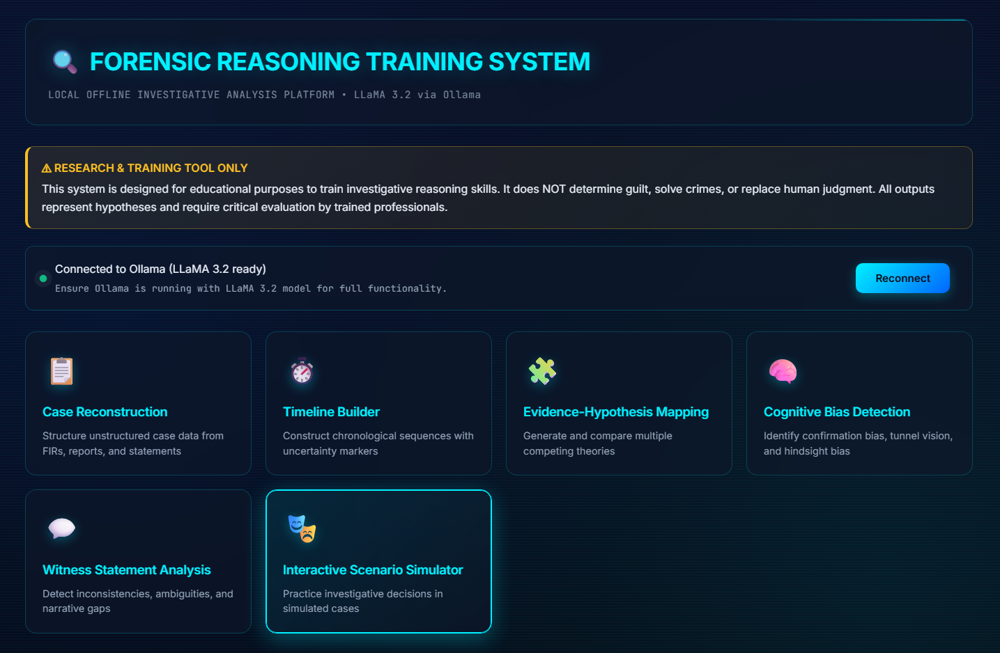

# 🔍 Forensic Reasoning Training System

### An Offline AI-Assisted Platform for Investigative Thinking & Bias-Aware Analysis

> **A local, offline, AI-powered training environment designed to strengthen forensic reasoning, hypothesis management, timeline construction, and cognitive bias awareness — without claiming to solve crimes.**



---

## 📌 Overview

The **Forensic Reasoning Training System (FRTS)** is a **single-file, browser-based training platform** that uses a locally running Large Language Model (LLaMA 3.2 via Ollama) to **support, challenge, and structure human investigative reasoning**.

Unlike predictive or classification-based forensic tools, this system is intentionally **non-decisional**:

* It does **not** determine guilt
* It does **not** identify suspects
* It does **not** automate conclusions

Instead, it acts as a **cognitive scaffold** for investigators, students, and researchers to practice *how* to think — not *what* to think.

---

## 🎯 Purpose & Research Motivation

### Why this project exists

Modern forensic failures often arise not from lack of data, but from:

* Tunnel vision
* Premature hypothesis fixation
* Misinterpretation of witness statements
* Cognitive biases embedded in reasoning
* Over-reliance on “intelligent” tools

This project explores a different direction:

> **Can AI be used to slow investigators down, expose uncertainty, and encourage better reasoning instead of faster conclusions?**

---

## 🧠 Core Training Modules

### 1️⃣ Case Reconstruction

* Converts unstructured inputs (FIRs, notes, reports) into structured investigative components
* Identifies:

  * Parties involved
  * Evidence mentioned
  * Timeline anchors
  * Information gaps
* Explicitly flags uncertainty and missing data

---

### 2️⃣ Timeline Builder

* Constructs chronological event sequences
* Uses uncertainty markers:

  * `[CONFIRMED]`
  * `[APPROXIMATE]`
  * `[UNCERTAIN]`
  * `[CONFLICT]`
  * `[GAP]`
* Highlights temporal contradictions and missing windows

---

### 3️⃣ Evidence–Hypothesis Mapping

* Generates **multiple competing hypotheses**
* For each hypothesis:

  * Supporting evidence
  * Contradictory evidence
  * Missing information
* Actively discourages single-theory fixation

---

### 4️⃣ Cognitive Bias Detection

* Analyzes investigative notes for:

  * Confirmation bias
  * Tunnel vision
  * Anchoring bias
  * Hindsight bias
  * Availability bias
* Provides mitigation strategies and reflective prompts
* Educational feedback, **not psychological diagnosis**

---

### 5️⃣ Witness Statement Analysis

* Identifies:

  * Inconsistencies
  * Ambiguities
  * Narrative gaps
  * Temporal confusion
* Explicitly **does not perform lie detection**
* Focuses on information quality, memory limits, and follow-up needs

---

### 6️⃣ Interactive Scenario Simulator

* AI-generated fictional cases
* Multiple valid investigative paths
* Consequences emerge based on user decisions
* Maintains ambiguity and uncertainty throughout
* Designed to train judgment under incomplete information

---

## 🔧 System Architecture

```
User Input
   ↓
Reasoning Prompt Design
   ↓
Local LLM (LLaMA 3.2 via Ollama)
   ↓
Structured Educational Output
   ↓
Human Critical Evaluation
```

* Entire system runs **locally**
* No cloud APIs
* No data logging
* No case storage

---

## 🧪 Methodology & Design Philosophy

### Key Principles

* **Bias-aware by design**
* **Uncertainty-first reasoning**
* **Multiple hypotheses over single answers**
* **Human-in-the-loop always**
* **Educational over operational**

### What the AI is allowed to do

✔ Structure information
✔ Generate alternatives
✔ Highlight gaps
✔ Ask better questions

### What the AI is forbidden to do

❌ Declare guilt
❌ Rank suspects
❌ Perform deception detection
❌ Replace human judgment

---

## 🛠️ Installation & Usage

### Prerequisites

* Modern web browser
* **Ollama installed locally**
* LLaMA 3.2 model pulled:

```bash
ollama pull llama3.2
```

### Running the Project

1. Save the file as `main.html`
2. Open it directly in a browser
3. Ensure Ollama is running:

```bash
ollama serve
```

The system automatically checks connectivity at:

```
http://localhost:11434
```

---

## 📂 Project Structure

```
Forensic-Reasoning-Training-System/
└── main.html   # Entire application (UI + logic)
```

No backend. No database. No external dependencies.

---

## ⚠ Ethical & Legal Disclaimer

* This system is **for training and research only**
* Outputs are **hypotheses, not conclusions**
* Not admissible as legal or forensic evidence
* Must not be used for real-world decision-making
* Designed to **reduce overconfidence**, not automate authority

---

## 🚧 Limitations

* Depends on quality of user input
* LLM reasoning may reflect training data biases
* No persistent case tracking
* No formal assessment or scoring
* Not validated for operational investigations

---

## 🔬 Research & Educational Scope

This project is suitable for:

* Criminology & forensic science education
* Cognitive bias research
* Human-centered AI studies
* Investigative training simulations
* Ethics of AI in justice systems

---

## 🚀 Future Improvements (TODO)

* [ ] Add case session persistence (local-only)
* [ ] Introduce structured evidence tagging
* [ ] Add investigator self-reflection prompts
* [ ] Support multi-investigator collaborative reasoning
* [ ] Include formal bias taxonomy references
* [ ] Export structured reasoning summaries (non-conclusive)
* [ ] Add pedagogy mode for instructors

---

## 👤 Credits

**Kartik Kashyap**<br>
Software Developer<br>
B.Tech Information Technology<br>
Criminology, Forensics & Human-Centered AI Research Enthusiast<br>
Contact: [kartikkashyapworks247@gmail.com](mailto:kartikkashyapworks247@gmail.com)

**Vaibhav Laxmi**<br>
Forensic & Criminology Domain Advisor<br>
B\.Sc. / M\.Sc. Criminology & Forensic Science, NFSU<br>
Contact: [vaibhav.bsmscrfs2242925@nfsu.ac.in](mailto:vaibhav.bsmscrfs2242925@nfsu.ac.in)

---

## 📜 License

MIT License
See the `LICENSE` file for full terms.