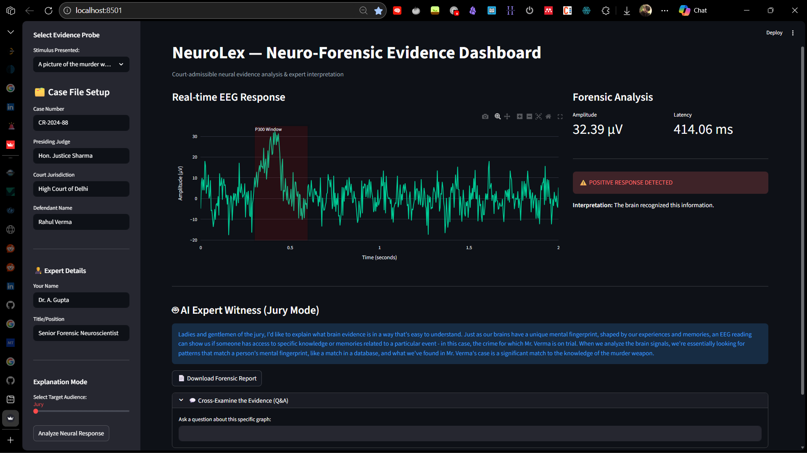

# 🧠 NeuroLex

### Neuro-Forensic Evidence Explainability & Expert Testimony Simulator

> **A human-centered, explainable neuro-forensic dashboard that simulates P300-based brain response analysis and translates technical EEG findings into legally interpretable expert testimony.**



---

## 📌 Overview

**NeuroLex** is a **Streamlit-based forensic explainability system** designed to demonstrate how **neural signals (P300 ERP)** can be:

* analyzed,
* interpreted,
* contextualized,
* and **explained differently to juries, judges, and experts**

— without claiming guilt, certainty, or admissibility.

This project focuses on **explainability, not prediction**.

---

## 🎯 Purpose & Research Motivation

### Why NeuroLex exists

In courtrooms, one of the biggest failures of forensic science is **not weak evidence**, but **poor explanation**:

* Judges misinterpret statistics
* Juries misunderstand neuroscience
* Experts overuse technical jargon
* AI outputs lack transparency

> NeuroLex explores how **the same neural data** can be responsibly explained at **different cognitive and legal levels**.

---

## 🧠 Scientific Background (Simplified)

* **P300 Event-Related Potential (ERP)**
  A positive EEG deflection occurring ~300–600 ms after stimulus recognition.

* **Key Metrics Used**

  * Peak amplitude (µV)
  * Latency (ms)
  * Signal-to-noise ratio (SNR)

* **Interpretation Principle**

  > Detection ≠ guilt
  > Detection = *recognition response under controlled stimulus*

This system **simulates** these signals for educational and forensic reasoning purposes.

---

## 🧪 System Architecture

```
Stimulus Selection
   ↓
Synthetic EEG Generation
   ↓
P300 Window Analysis
   ↓
Metric Extraction
   ↓
Explainable AI (LLaMA 3.2)
   ↓
Audience-Specific Expert Testimony
   ↓
Court-Style PDF Report
```

Everything runs **locally**.

---

## 🧩 Key Features

### 🔹 EEG Signal Simulation

* Synthetic EEG with:

  * Alpha background rhythm
  * Gaussian P300 spike for probe stimuli
* Adjustable stimulus type (Neutral / Probe / Target)

---

### 🔹 Forensic Signal Analysis

* Automated extraction of:

  * Amplitude
  * Latency
  * SNR
* Highlighted P300 analysis window
* Transparent detection logic (no black box)

---

### 🔹 Explainable AI Expert Witness

Using **LLaMA 3.2 via Ollama**, explanations adapt to:

| Audience | Style                           |
| -------- | ------------------------------- |
| Jury     | Analogical, non-technical       |
| Judge    | Formal, legal reliability focus |
| Expert   | Technical, neurophysiological   |

---

### 🔹 Cross-Examination Mode

* Ask follow-up questions about:

  * Graphs
  * Metrics
  * Detection logic
* AI answers strictly from **current evidence**

---

### 🔹 Court-Ready PDF Report

* Case metadata
* Signal metrics
* Expert explanation
* Professional formatting
* Downloadable forensic report

---

## ⚖️ Ethical Positioning

* ❌ No lie detection claims
* ❌ No guilt inference
* ❌ No operational deployment
* ✅ Educational & research use only
* ✅ Emphasizes uncertainty & interpretation limits

---

## 🛠️ Installation & Setup

### Prerequisites

* Python 3.9+
* Ollama installed locally
* LLaMA 3.2 pulled:

```bash
ollama pull llama3.2
```

---

### Install Dependencies

```bash
pip install -r requirements.txt
```

---

### Run Application

```bash
streamlit run app.py
```

---

## 📂 Project Structure

```
NeuroLex/
├── app.py              # Streamlit UI & orchestration
├── data_gen.py         # EEG signal simulation
├── analysis.py         # P300 feature extraction
├── ai_expert.py        # Explainable AI expert witness
├── report_gen.py       # PDF report generation
├── requirements.txt
└── LICENSE
```

---

## 🚧 Limitations

* Uses synthetic EEG data (no real subjects)
* Simplified SNR and threshold logic
* Not clinically validated
* Not legally admissible
* Depends on LLM consistency

---

## 🚀 Future Improvements (TODO)

* [ ] Integrate real EEG datasets (research-only)
* [ ] Add artifact rejection simulation
* [ ] Support multiple ERP components
* [ ] Introduce adversarial cross-examination mode
* [ ] Add statistical confidence intervals
* [ ] Court admissibility checklist module
* [ ] Bias & overinterpretation warnings

---

## 👤 Credits

**Kartik Kashyap**<br>
Software Developer<br>
B.Tech Information Technology<br>
Criminology, Forensics & Human-Centered AI Research Enthusiast<br>
Contact: [kartikkashyapworks247@gmail.com](mailto:kartikkashyapworks247@gmail.com)

**Vaibhav Laxmi**<br>
Forensic & Criminology Domain Advisor<br>
B\.Sc. / M\.Sc. Criminology & Forensic Science, NFSU<br>
Contact: [vaibhav.bsmscrfs2242925@nfsu.ac.in](mailto:vaibhav.bsmscrfs2242925@nfsu.ac.in)

---

## 📜 License

MIT License
See the `LICENSE` file for full terms.