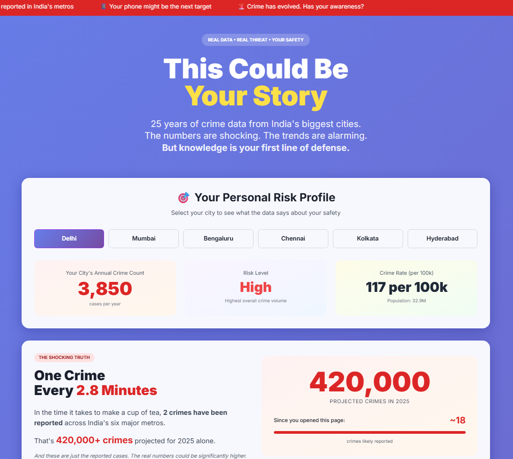
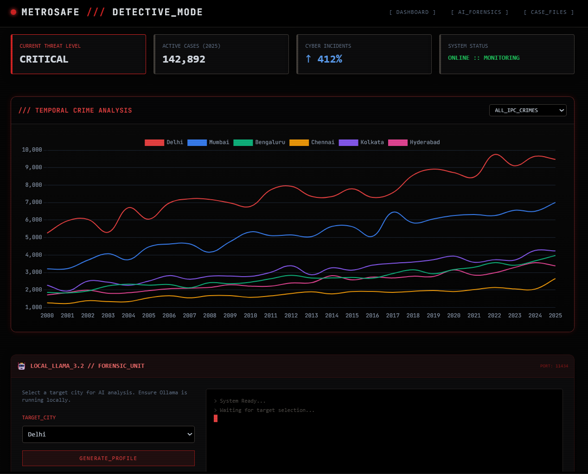

# 🛡️ MetroSafe — Dual-Layer Crime Analytics Platform

> **From Public Awareness to Investigative Intelligence**
> A two-dashboard system designed to communicate crime data responsibly across *very different audiences* — the general public and forensic / investigative professionals.


> **One dataset → Two epistemic lenses → Two ethical responsibilities**


---

## Project Architecture (Final)

```
/
├── metrosafe-public-dashboard.html          # Public awareness & safety storytelling
├── metrosafe-forensic-ai-dashboard.html     # Restricted forensic & AI-assisted analysis
├── assets/
│   └── screenshots/
│       ├── metrosafe-forensic.png
│       └── metrosafe-public.png
├── LICENSE
└── README.md
```

Both dashboards live at the **same level**, intentionally — they are *parallel viewpoints*, not a hierarchy.

---

## 1️⃣ Public Crime Awareness Dashboard

📄 File: [metrosafe-public-dashboard.html](metrosafe-public-dashboard.html)



### Purpose

This dashboard is built for **citizens, students, journalists, and policymakers**.

Its job is *not* investigation — it is **awareness, prevention, and risk literacy**.

It answers questions like:

* *“How has crime changed over 25 years?”*
* *“Which crimes are growing fastest — and why?”*
* *“What does this mean for me, personally?”*

### Key Characteristics

* Narrative-driven storytelling ("This Could Be Your Story")
* City-level **personal risk profiling**
* Time-based shock metrics (live crime counters)
* Strong emphasis on **cybercrime evolution**
* Dedicated sections on women’s safety and digital threats

### Methodology (Simplified)

* NCRB-inspired metropolitan crime structures
* Longitudinal simulation (2000–2025)
* CAGR-based projections for post-2023 values
* Intentional visual exaggeration to improve *risk perception*, not prediction

> ⚠️ **Important:** Numbers are *educationally simulated*, not official statistics. The goal is awareness, not reporting.

### Why this matters

Most crime dashboards fail because they:

* overload users with tables, or
* present numbers without emotional context

This dashboard deliberately blends **data + psychology + narrative** — because public safety depends on *behavior change*, not spreadsheets.

---

## 2️⃣ Forensic AI Crime Analytics Dashboard

📄 File: [metrosafe-forensic-ai-dashboard.html](metrosafe-forensic-ai-dashboard.html)



### Purpose

This dashboard is designed for:

* criminology students
* forensic researchers
* investigative analysts
* security & policy professionals

It is **not** for public circulation.

Its role is to support:

* pattern recognition
* comparative analysis
* hypothesis formulation
* analyst intuition building

### Core Capabilities

* Multi-city temporal crime trend analysis
* Radar-based threat profiling
* Year-wise regional comparisons
* Raw evidence table with CSV export
* **Local AI-powered forensic narration** (LLaMA 3.2 via Ollama)

### AI Integration Philosophy

The AI here is *not* used to predict crimes.

Instead, it acts as:

* a **narrative compression layer**
* a reasoning assistant
* a way to surface latent patterns analysts might miss

Example output style:

> “The villains aren’t on the streets anymore — they’re hiding in the wires.”

This is intentional. Investigators think in **stories, not charts**.

### Technical Notes

* Runs fully offline with `ollama serve`
* Uses `llama3.2` locally (no cloud dependency)
* Graceful fallback when AI is unavailable

> ⚠️ AI output is **interpretive**, not evidentiary. It must never be treated as legal proof.

---

## Ethical Separation

| Layer                 | Audience | Responsibility                     |
| --------------------- | -------- | ---------------------------------- |
| Public Dashboard      | Citizens | Awareness, prevention, empowerment |
| Forensic-AI Dashboard | Analysts | Reasoning, hypothesis, exploration |

---

## How to Run

### Public Dashboard

```bash
# Just open in a browser
open public-dashboard.html
```

No backend. No setup. Shareable.

### Forensic-AI Dashboard (Optional AI)

```bash
# Install Ollama
ollama pull llama3.2
ollama serve

# Then open
open forensic-ai-dashboard.html
```

If Ollama is not running, the dashboard still works — AI insights gracefully fall back.

---

## Limitations & Known Gaps

* Crime data is **simulated**, not scraped live
* NCRB definition changes across years are approximated
* AI analysis is narrative, not statistically validated
* No user authentication (by design — static demo)


---

## Future Improvements (TODO)

* [ ] Plug real NCRB CSVs for selected years
* [ ] Add per-capita normalization toggle
* [ ] Introduce investigator annotation mode
* [ ] Add bias & uncertainty markers in AI text
* [ ] Export AI logs as case notes

---

## Credits

**Kartik Kashyap**<br>
Software Developer<br>
B.Tech Information Technology<br>
Criminology, Forensics & Human-Centered AI Research Enthusiast<br>
Contact: [kartikkashyapworks247@gmail.com](mailto:kartikkashyapworks247@gmail.com)

**Vaibhav Laxmi**<br>
Forensic & Criminology Domain Advisor<br>
B\.Sc. / M\.Sc. Criminology & Forensic Science, NFSU<br>
Contact: [vaibhav.bsmscrfs2242925@nfsu.ac.in](mailto:vaibhav.bsmscrfs2242925@nfsu.ac.in)

---

## License

MIT License
See the `LICENSE` file for full terms.

---

> *Data can inform. Stories can persuade.
> Responsible systems must do both — without crossing the line.*
