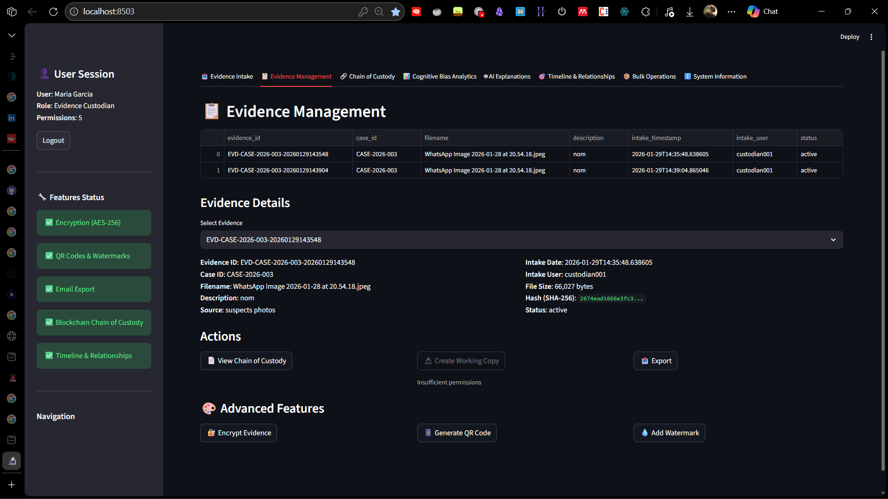
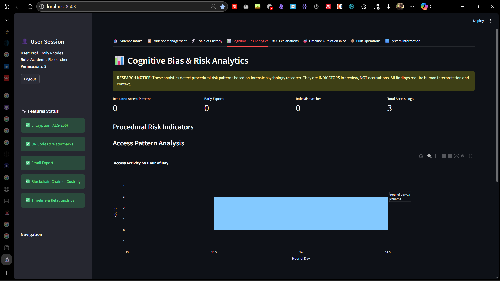
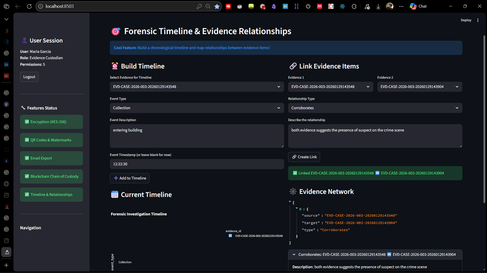
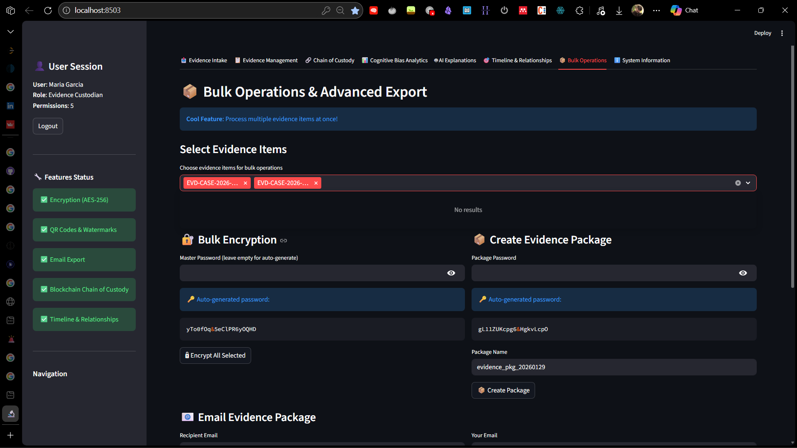

# Human-Centered Digital Forensic Evidence Management System

## Academic Research Prototype

**Version:** 1.0.0  
**Purpose:** Research tool for studying human factors, cognitive bias, and procedural integrity in digital forensics  
**Status:** Academic prototype - NOT for production law enforcement use

---

## Table of Contents

1. [Overview](#overview)
2. [Research Goals](#research-goals)
3. [Installation](#installation)
4. [Usage](#usage)
5. [System Architecture](#system-architecture)
6. [Design Rationale](#design-rationale)
7. [Forensic Psychology Integration](#forensic-psychology-integration)
8. [Ethical Considerations](#ethical-considerations)
9. [Limitations](#limitations)
10. [Research Applications](#research-applications)

---

## Overview

This system demonstrates how **human-centered design principles**, **forensic psychology research**, and **explainable AI** can improve digital forensic workflows. The system focuses on:

- **Evidence Integrity**: Cryptographic verification and immutable storage
- **Chain of Custody**: Blockchain-inspired audit trails
- **Cognitive Bias Detection**: Behavioral pattern analysis
- **Procedural Transparency**: AI-assisted explanations
- **Role-Based Access Control**: Separation of duties and least privilege

### What This System Does NOT Do

❌ Analyze evidence content  
❌ Determine guilt or innocence  
❌ Replace human judgment  
❌ Accuse individuals of misconduct  

### What This System DOES Do

✅ Preserve evidence integrity  
✅ Maintain legally defensible custody chains  
✅ Detect procedural risk patterns  
✅ Provide educational feedback  
✅ Enable research on investigative behavior  

### System Gallery
| Evidence Management | Cognitive Bias Analytics |
|:---:|:---:|
|  |  |

| Forensic Timeline | Bulk Operations & Encryption |
|:---:|:---:|
|  |  |

---

## Research Goals

This prototype enables research on:

1. **Cognitive Bias in Forensic Investigations**
   - How confirmation bias affects evidence selection
   - Impact of anchoring on early conclusions
   - Selective attention patterns

2. **Procedural Compliance**
   - Role-based access effectiveness
   - Chain of custody integrity
   - Documentation quality

3. **Human-AI Collaboration**
   - Effectiveness of AI explanations
   - Trust in automated systems
   - Transparency requirements

4. **Training and Education**
   - Behavioral feedback effectiveness
   - Procedural awareness improvement
   - Best practice adoption

---

## Installation

### Prerequisites

- Python 3.9 or higher
- Ollama (for local LLM integration)

### Step 1: Install Python Dependencies

```bash
pip install -r requirements.txt
```

### Step 2: Install Ollama and Llama 3.2

**On Linux/Mac:**
```bash
curl -fsSL https://ollama.ai/install.sh | sh
ollama pull llama3.2
```

**On Windows:**
Download from https://ollama.ai/download

### Step 3: Start Ollama Service

```bash
ollama serve
```

Keep this running in a separate terminal.

### Step 4: Run the Application

```bash
streamlit run app.py
```

The application will open in your browser at `http://localhost:8501`

---

## Usage

### Demo Accounts

The system includes five role-based demo accounts:

| User ID | Name | Role | Password |
|---------|------|------|----------|
| `inv001` | Sarah Chen | Field Investigator | `demo123` |
| `analyst001` | Dr. James Wilson | Forensic Analyst | `demo123` |
| `custodian001` | Maria Garcia | Evidence Custodian | `demo123` |
| `sup001` | Lt. Robert Taylor | Case Supervisor | `demo123` |
| `research001` | Prof. Emily Rhodes | Academic Researcher | `demo123` |

### Basic Workflow

1. **Login** as Evidence Custodian (`custodian001`)
2. **Intake Evidence**: Upload a file (image, document, etc.)
3. **Switch Users**: Logout and login as different roles
4. **Access Evidence**: View and interact based on role permissions
5. **View Analytics**: Login as Supervisor to see bias indicators
6. **Generate Reports**: Use AI explanations for documentation

### Supported Evidence Types

- **Images**: JPG, PNG
- **Documents**: PDF
- **Video**: MP4
- **Audio**: WAV
- **Disk Images**: DD, IMG (hash-only, no modification)

---

## System Architecture

### Directory Structure

```
EMS-human-centered/
├── app.py                          # Main application
├── requirements.txt                # Python dependencies
├── README.md                       # This file
└── evidence_vault/                 # Evidence storage (auto-created)
    ├── original/                   # Immutable original evidence
    ├── working_copies/             # Analysis copies
    └── exports/                    # Court-ready exports
```

### Core Components

#### 1. Evidence Management
- **Immutable Storage**: Original evidence never modified
- **Working Copies**: Separate files for analysis
- **Cryptographic Hashing**: SHA-256 verification
- **Metadata Tracking**: Complete provenance documentation

#### 2. Chain of Custody
- **Hash Chaining**: Blockchain-inspired linking
- **Tamper Detection**: Cryptographic verification
- **Complete Audit Trail**: Every interaction logged
- **Temporal Reconstruction**: Full timeline available

#### 3. Access Control (RBAC)
- **Role-Based Permissions**: Five distinct roles
- **Explicit Authorization**: All actions verified
- **Denied Attempt Logging**: Security auditing
- **Separation of Duties**: No single point of failure

#### 4. Cognitive Bias Detection
- **Repeated Access Patterns**: Confirmation bias indicator
- **Early Exports**: Premature conclusion detection
- **Temporal Clustering**: Tunnel vision identification
- **Selective Focus**: Contradictory evidence avoidance

#### 5. AI Integration (Explainable)
- **Local LLM**: Llama 3.2 via Ollama
- **Procedural Explanations**: Not evidence interpretation
- **Court-Readable Summaries**: Chain of custody narratives
- **Risk Indicator Explanations**: Plain language alerts

---

## Design Rationale

### Forensic Psychology Perspective

#### 1. Confirmation Bias Mitigation

**Problem**: Investigators tend to focus on evidence supporting their hypothesis while ignoring contradictory evidence (Kassin et al., 2013).

**Design Solution**:
- Track access frequency to each evidence item
- Alert when disproportionate attention to specific evidence
- Encourage comprehensive evidence review

#### 2. Anchoring Bias Prevention

**Problem**: Early information disproportionately influences subsequent decisions (Tversky & Kahneman, 1974).

**Design Solution**:
- Detect early exports (premature conclusions)
- Track temporal patterns of evidence access
- Require justifications for all actions

#### 3. Cognitive Load Reduction

**Problem**: Complex investigations overwhelm working memory, leading to errors (Sweller, 1988).

**Design Solution**:
- Clear role separation reduces decision complexity
- AI-generated summaries reduce information processing burden
- Structured workflows minimize cognitive overhead

#### 4. Procedural Justice

**Problem**: Perceived unfairness reduces cooperation and trust (Tyler, 2006).

**Design Solution**:
- Complete transparency in all actions
- Explainable AI outputs
- Non-accusatory feedback (indicators, not accusations)

### Legal and Criminological Perspective

#### 1. Chain of Custody Requirements

**Legal Standard**: Federal Rules of Evidence require complete documentation of evidence handling.

**Implementation**:
- Cryptographic hash chaining ensures tamper detection
- Every interaction logged with timestamp, user, and justification
- Immutable audit trail suitable for court presentation

#### 2. Digital Evidence Integrity (NIST SP 800-86)

**Standard**: Original evidence must remain unmodified; analysis on copies only.

**Implementation**:
- Strict separation of original and working directories
- Hash verification before and after storage
- Working copies clearly marked and tracked

#### 3. Authentication and Authorization

**Principle**: Only authorized personnel should access evidence (principle of least privilege).

**Implementation**:
- Role-based access control with explicit permissions
- All denied attempts logged for security auditing
- No privilege escalation without explicit role change

---

## Forensic Psychology Integration

### Theoretical Framework

This system integrates research from multiple domains:

#### Cognitive Biases in Forensic Science

**Key Research**:
- Kassin, S. M., Dror, I. E., & Kukucka, J. (2013). "The forensic confirmation bias: Problems, perspectives, and proposed solutions." *Journal of Applied Research in Memory and Cognition*, 2(1), 42-52.

**Application in System**:
- Repeated access detection identifies potential confirmation bias
- Temporal pattern analysis reveals tunnel vision
- Selective attention metrics highlight evidence avoidance

#### Decision-Making Under Uncertainty

**Key Research**:
- Kahneman, D., & Tversky, A. (1974). "Judgment under uncertainty: Heuristics and biases." *Science*, 185(4157), 1124-1131.

**Application in System**:
- Early export detection prevents anchoring-based premature closure
- Justification requirements force deliberative processing
- AI explanations reduce uncertainty through transparency

#### Procedural Justice Theory

**Key Research**:
- Tyler, T. R. (2006). "Psychological perspectives on legitimacy and legitimation." *Annual Review of Psychology*, 57, 375-400.

**Application in System**:
- Complete transparency in all procedures
- Non-accusatory feedback maintains dignity
- Explainable AI ensures perceived fairness

### Behavioral Metrics

The system tracks multiple behavioral indicators:

1. **Access Frequency**: How often each evidence item is examined
2. **Temporal Patterns**: When evidence is accessed (time of day, investigation phase)
3. **Role Compliance**: Whether actions match assigned permissions
4. **Justification Quality**: Completeness of action explanations
5. **Evidence Breadth**: Distribution of attention across case materials

### Risk Indicators (Not Accusations)

All alerts are framed as **procedural risk indicators** requiring human interpretation:

- ✅ "Repeated access pattern detected - consider reviewing other evidence"
- ❌ "Investigator is biased and ignoring evidence"

This framing:
- Maintains dignity and professionalism
- Encourages self-reflection
- Enables learning without defensiveness
- Suitable for training and education

---

## Ethical Considerations

### Privacy and Data Minimization

- No personal information stored beyond role-based identifiers
- Evidence content never analyzed by AI
- Behavioral data aggregated for research, not individual monitoring

### Transparency and Explainability

- All AI outputs include explanations of reasoning
- Users can query the system about any procedure
- No "black box" decision-making

### Non-Discrimination

- Bias indicators apply equally to all users
- No profiling based on personal characteristics
- Role-based permissions only

### Human Oversight

- All findings require expert interpretation
- No automated consequences
- System provides advisory information only

### Research Ethics

- Informed consent required for any research use
- Data anonymization for publication
- Institutional review board approval recommended

---

## Limitations

### Technical Limitations

1. **Simplified Authentication**: Demo uses simple passwords; production needs multi-factor authentication
2. **Local Storage**: Evidence stored locally; production needs encrypted databases
3. **Single Instance**: No multi-user concurrency; production needs client-server architecture
4. **LLM Dependency**: Requires Ollama service running; offline mode not available

### Analytical Limitations

1. **False Positives**: Behavioral indicators may flag legitimate investigative patterns
2. **Context Blindness**: System cannot understand case-specific circumstances
3. **Threshold Arbitrariness**: Access count thresholds (e.g., >5) are research parameters
4. **No Ground Truth**: Cannot verify if bias actually occurred

### Legal Limitations

1. **Not Court-Tested**: Chain of custody format not validated in legal proceedings
2. **Jurisdictional Variance**: Legal standards vary by jurisdiction
3. **Expert Testimony Required**: System outputs need expert interpretation for court use

### Research Limitations

1. **Small Sample**: Demo accounts insufficient for statistical analysis
2. **Artificial Scenarios**: Real investigations more complex than demo workflows
3. **Hawthorne Effect**: Awareness of monitoring may change behavior
4. **Generalizability**: Results may not transfer to other forensic contexts

---

## Research Applications

### Experimental Studies

This system can support research on:

1. **Bias Awareness Training**
   - Does showing bias indicators reduce biased behavior?
   - What feedback mechanisms are most effective?
   - How do experts vs. novices respond to alerts?

2. **Procedural Compliance**
   - Impact of RBAC on rule-following behavior
   - Effectiveness of justification requirements
   - Chain of custody documentation quality

3. **Human-AI Collaboration**
   - Trust calibration in AI explanations
   - Reliance on automated summaries
   - Transparency requirements for acceptance

4. **Cognitive Load**
   - Impact of structured workflows on decision quality
   - Role specialization vs. generalization
   - Information visualization effectiveness

### Educational Applications

1. **Forensic Science Training**
   - Demonstrate importance of chain of custody
   - Illustrate cognitive biases in practice
   - Practice proper evidence handling procedures

2. **Criminal Justice Education**
   - Explore procedural justice principles
   - Understand separation of duties
   - Learn digital evidence standards

3. **Psychology Courses**
   - Real-world application of cognitive bias research
   - Human factors in high-stakes decision-making
   - Behavioral pattern recognition

### Case Studies

The system can be used to:
- Reconstruct investigative timelines
- Identify procedural deviations
- Generate teaching scenarios
- Develop best practice guidelines

---

## Project Documentation

To fully explore the system's capabilities, please refer to the specialized guides below:

### Research & Theory
* **[Design Rationale](DESIGN_RATIONALE.md)**: A deep dive into the forensic psychology and criminology principles (Confirmation Bias, Anchoring, etc.) that power the system's logic.
* **[Research Protocol](RESEARCH_PROTOCOL.md)**: A template for academics to conduct IRB-approved studies, including sample experimental scenarios and data analysis plans.

### Getting Started
* **[Quick Start: Investigative Workflow](QUICKSTART_WORKFLOW.md)**: Focused on the **human element**. Follow this guide to see how bias alerts and AI explanations trigger during a simulated investigation.
* **[Quick Start: Technical Features](QUICKSTART_FEATURES.md)**: Focused on **utility**. Follow this guide to test AES-256 encryption, QR code generation, and bulk evidence packaging.

---

## Technical Documentation

### Evidence Intake Process

```python
# 1. User uploads file
# 2. System generates unique evidence ID
evidence_id = f"EVD-{case_id}-{timestamp}"

# 3. Compute SHA-256 hash
file_hash = hashlib.sha256(file_content).hexdigest()

# 4. Store in immutable directory
save_to(ORIGINAL_DIR / evidence_id)

# 5. Create custody chain entry
add_custody_entry(
    evidence_id=evidence_id,
    action="INTAKE",
    user=current_user,
    justification="Evidence collected from {source}"
)

# 6. Log access
log_access_attempt(
    action="intake_evidence",
    evidence_id=evidence_id,
    success=True
)
```

### Chain of Custody Verification

```python
# Verify hash chain integrity
def verify_custody_chain():
    previous_hash = "GENESIS"
    
    for entry in custody_chain:
        # Recompute hash
        entry_data = json.dumps(entry_without_hash)
        computed_hash = sha256(previous_hash + entry_data)
        
        # Compare with stored hash
        if computed_hash != entry.chain_hash:
            return False, "Chain break detected"
        
        previous_hash = entry.chain_hash
    
    return True, "Chain integrity verified"
```

### Bias Detection Algorithm

```python
# Detect repeated access patterns
def detect_confirmation_bias():
    access_counts = count_accesses_per_evidence()
    
    for evidence_id, count in access_counts.items():
        if count > THRESHOLD:  # e.g., 5 accesses
            yield {
                "type": "repeated_access",
                "evidence_id": evidence_id,
                "count": count,
                "risk_level": "moderate" if count < 10 else "high",
                "recommendation": "Review other case evidence"
            }
```

---

## Future Enhancements

Potential extensions for advanced research:

1. **Machine Learning Integration**
   - Pattern recognition in access behaviors
   - Predictive modeling of procedural violations
   - Anomaly detection in custody chains

2. **Multi-Modal Evidence**
   - Integrated timeline visualization
   - Cross-evidence relationship mapping
   - Automated evidence correlation

3. **Collaboration Features**
   - Real-time multi-user access
   - Commenting and annotation systems
   - Peer review workflows

4. **Advanced Analytics**
   - Social network analysis of investigator interactions
   - Temporal pattern mining
   - Comparative case analysis

5. **Integration Capabilities**
   - Export to legal case management systems
   - Import from forensic acquisition tools
   - API for external analytics platforms

---

## References

### Forensic Psychology

- Kassin, S. M., Dror, I. E., & Kukucka, J. (2013). The forensic confirmation bias: Problems, perspectives, and proposed solutions. *Journal of Applied Research in Memory and Cognition*, 2(1), 42-52.

- Dror, I. E. (2020). Cognitive and human factors in expert decision making: Six fallacies and the eight sources of bias. *Analytical Chemistry*, 92(12), 7998-8004.

- Kukucka, J., Kassin, S. M., Zapf, P. A., & Dror, I. E. (2017). Cognitive bias and blindness: A global survey of forensic science examiners. *Journal of Applied Research in Memory and Cognition*, 6(4), 452-459.

### Cognitive Psychology

- Kahneman, D., & Tversky, A. (1974). Judgment under uncertainty: Heuristics and biases. *Science*, 185(4157), 1124-1131.

- Sweller, J. (1988). Cognitive load during problem solving: Effects on learning. *Cognitive Science*, 12(2), 257-285.

- Nickerson, R. S. (1998). Confirmation bias: A ubiquitous phenomenon in many guises. *Review of General Psychology*, 2(2), 175-220.

### Digital Forensics

- Casey, E. (2011). *Digital evidence and computer crime: Forensic science, computers, and the internet* (3rd ed.). Academic Press.

- NIST (2006). Special Publication 800-86: Guide to integrating forensic techniques into incident response. National Institute of Standards and Technology.

- Garfinkel, S. L. (2010). Digital forensics research: The next 10 years. *Digital Investigation*, 7, S64-S73.

### Procedural Justice

- Tyler, T. R. (2006). Psychological perspectives on legitimacy and legitimation. *Annual Review of Psychology*, 57, 375-400.

- Tyler, T. R., & Huo, Y. J. (2002). *Trust in the law: Encouraging public cooperation with the police and courts*. Russell Sage Foundation.

### Legal Standards

- Federal Rules of Evidence (2023). Rule 901: Authenticating or identifying evidence.

- Daubert v. Merrell Dow Pharmaceuticals, Inc., 509 U.S. 579 (1993).

- Lorraine v. Markel American Insurance Co., 241 F.R.D. 534 (D. Md. 2007).

---

## License

**Academic Research Use Only**

This software is provided for academic research and educational purposes only. It is NOT licensed for production law enforcement use, commercial use, or deployment in real criminal investigations.

Researchers using this system should:
- Obtain institutional review board (IRB) approval for human subjects research
- Provide informed consent to participants
- Anonymize data for publication
- Acknowledge limitations in any published work

---

## Contact

For research inquiries, bug reports, or collaboration opportunities:

**This is a demonstration system.** In a production environment, contact information for the research team would be provided here.

---

## Credits & Acknowledgments

This system was developed as an academic prototype to demonstrate the integration of forensic psychology principles into digital evidence management. It draws on decades of research in cognitive psychology, forensic science, human-computer interaction, and criminal justice.

**Kartik Kashyap**<br>
Software Developer<br>
B.Tech Information Technology<br>
Criminology, Forensics & Human-Centered AI Research Enthusiast<br>
Contact: [kartikkashyapworks247@gmail.com](mailto:kartikkashyapworks247@gmail.com)

**Vaibhav Laxmi**<br>
Forensic & Criminology Domain Advisor<br>
B\.Sc. / M\.Sc. Criminology & Forensic Science, NFSU<br>
Contact: [vaibhav.bsmscrfs2242925@nfsu.ac.in](mailto:vaibhav.bsmscrfs2242925@nfsu.ac.in)

Special acknowledgment to the researchers whose work forms the theoretical foundation of this system, particularly:
- Saul Kassin and Itiel Dror (forensic confirmation bias)
- Daniel Kahneman and Amos Tversky (judgment and decision-making)
- Tom Tyler (procedural justice)
- Eoghan Casey (digital forensics standards)

---

**Version**: 1.0.0  
**Last Updated**: January 2026  
**Status**: Academic Research Prototype
