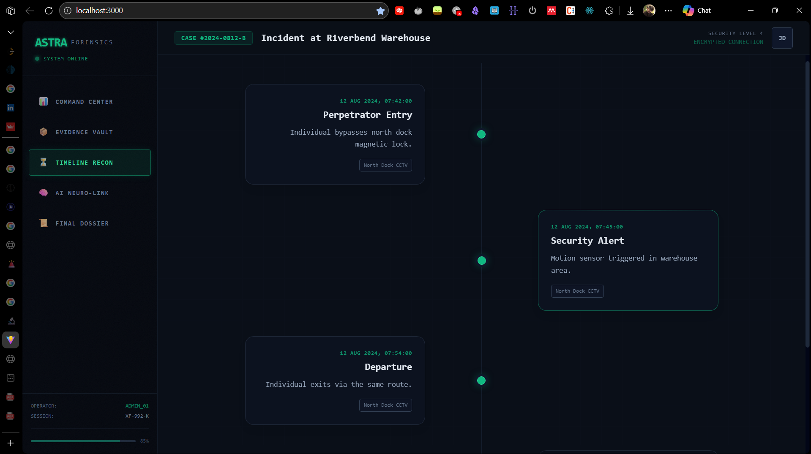
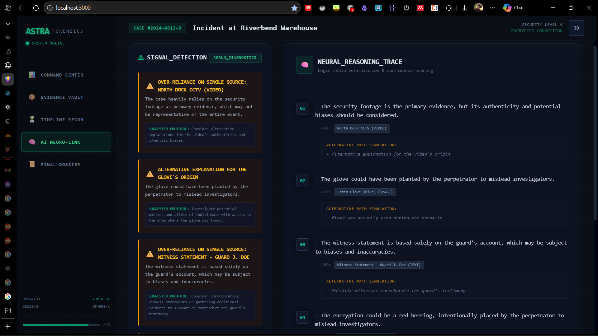

# Astra Forensic Engine
 
 A research-oriented forensic case analysis interface that simulates core workflows used in modern investigations:
 
 - Evidence inventory and integrity surfacing ("Evidence Vault")
 - Event reconstruction ("Timeline Recon")
 - AI-assisted *bias-aware* review with structured reasoning traces ("AI Neuro-Link")
 
 This repository is currently implemented as a **single-page Vite + React** application with mock case data and an optional local AI backend (Ollama).
 
 ## Screenshots
 
 ### Evidence Vault
 
 
 
 ### Timeline Recon
 
 
 
 ### AI Neuro-Link
 
 
 
 ## Project Motivation and Research Scope
 
 Astra Forensic Engine is motivated by a practical gap in many real-world and academic forensic workflows:
 
 - Investigations often span *heterogeneous evidence* (video, images, device dumps, witness statements).
 - Analysts must reconstruct a coherent *temporal narrative* while preserving *traceability back to source artifacts*.
 - Human reasoning is vulnerable to cognitive pitfalls (confirmation bias, availability bias, over-reliance on a single source).
 
 This project explores a UI and data model that treats a case as:
 
 - **Evidence objects** with associated timestamps, provenance, tags, confidence levels, and integrity identifiers.
 - **Timeline events** that link back to evidence IDs (supporting traceability).
 - **AI-assisted peer review** focused on *bias detection* and *alternative hypotheses* rather than asserting guilt/innocence.
 
 Research scope (what this project aims to demonstrate):
 
 - A clear separation between **evidence artifacts** and **interpretive events**.
 - How timeline reconstruction can reduce narrative drift and improve auditability.
 - How an LLM can be used as a *review layer* to:
   - Flag missing falsification steps
   - Encourage alternative explanations
   - Produce a structured reasoning log that can be discussed and challenged
 
 ## Key Features and Capabilities
 
 ### 1) Evidence Vault
 
 - Stores a case’s evidence inventory (mock dataset in `App.tsx`).
 - Shows per-item:
   - Type (IMAGE/VIDEO/AUDIO/DOCUMENT/TEXT)
   - Timestamp
   - Description + tags
   - Confidence level
   - A displayed “hash notary” value (simulated)
 
 In real forensic systems, this concept maps to:
 
 - A central evidence registry (e.g., digital evidence management system)
 - Chain-of-custody metadata and integrity verification
 - Cross-referencing items to reports, events, and investigative hypotheses
 
 **Important:** this repo currently uses a *mock hash generator* for demonstration only.
 
 ### 2) Timeline Recon (Timeline Reconstruction)
 
 The Timeline feature is implemented using:
 
 - `types.ts`:
   - `TimelineEvent` with `startTime`, optional `endTime`, and `linkedEvidenceIds`
 - `components/TimelineView.tsx`:
   - Events are **sorted** by `startTime`
   - Each event displays its time and title/description
   - Evidence is **joined** by `linkedEvidenceIds` to show which artifacts support the event
 
 Why timeline reconstruction matters in real forensic systems:
 
 - **Consistency checks across sources**: aligning CCTV timestamps with access logs, device activity, and witness statements can expose contradictions.
 - **Traceability**: every timeline claim should be defensible by direct references to evidence items.
 - **Gaps and missing evidence detection**: a timeline makes “quiet periods” visible and prompts questions like “what evidence should exist here?”
 - **Courtroom readiness**: a clear, referenced chronology reduces ambiguity and supports expert testimony.
 
 In production-grade tools, a timeline engine would also incorporate:
 
 - Clock drift handling and timezone normalization
 - Multiple time sources (filesystem MACB times, EXIF, logs, telemetry)
 - Event confidence scoring and conflict resolution
 - Support for event intervals (`endTime`) and uncertainty bounds
 
 ### 3) AI Neuro-Link (Bias-Aware Reasoning + Explainable Review)
 
 The AI Neuro-Link feature is designed as a “second set of eyes” layer: it does *not* decide outcomes, it critiques reasoning quality.
 
 Implementation overview:
 
 - UI:
   - `components/AnalysisView.tsx`
   - Shows:
     - **Bias alerts** (`BiasAlert[]`)
     - **Neural reasoning trace** (`AIReasoningLog[]`) as step-by-step entries
 - Service:
   - `services/geminiService.ts` (name is legacy; current implementation calls Ollama)
   - Calls a local Ollama endpoint:
     - `http://localhost:11434/api/generate`
     - Model: `llama3.2`
   - Sends a system instruction that enforces:
     - Neutrality (no guilt/innocence declarations)
     - Bias identification
     - Alternative hypotheses
     - Output in strict JSON
 
 Why this helps in real forensic systems:
 
 - **Bias surfacing in narrative building**: investigators often converge on a suspect early; an automated review can repeatedly prompt falsification attempts.
 - **Structured critique instead of free-form text**: returning typed alerts and reasoning steps supports review boards, peer review, and training.
 - **Auditable AI output**: a step log is easier to challenge than a single summary paragraph.
 - **Training and education**: trainees can compare their reasoning chain to a “review layer” that highlights common pitfalls.
 
 Recommended operational posture in real deployments:
 
 - Treat AI output as **non-authoritative** and **review-only**.
 - Keep prompts and outputs **case-auditable** (logging, redaction, retention policies).
 - Run models **locally** (as in this repo with Ollama) when dealing with sensitive investigations.
 
 ## Methodology (How Astra Models a Case)
 
 - **Case as a dataset**: a `Case` contains `evidence[]` and `events[]`.
 - **Evidence-first traceability**: events link back to evidence IDs, not the other way around.
 - **Confidence & provenance surfaced at the UI**: confidence levels help separate verified artifacts from uncertain leads.
 - **AI as peer reviewer**:
   - The prompt includes:
     - Case summary
     - Evidence descriptions
     - Timeline event titles
   - The output must be parseable JSON matching:
     - `BiasAlert[]`
     - `AIReasoningLog[]`
 
 ## Repository / File Structure
 
 High-level structure:
 
 - **`App.tsx`**
   - Main UI router (tab switching)
   - Contains mock case dataset (`INITIAL_CASE`)
 - **`components/`**
   - `Layout.tsx`: sidebar + header + main layout
   - `EvidenceCard.tsx`: evidence presentation
   - `TimelineView.tsx`: event reconstruction timeline
   - `AnalysisView.tsx`: AI Neuro-Link UI
 - **`services/`**
   - `geminiService.ts`: AI callout to local Ollama (`llama3.2`) and JSON parsing
 - **`utils/`**
   - `forensics.ts`: mock hash + timestamp formatting + evidence icons
 - **`types.ts`**
   - Shared TypeScript types for evidence, timeline events, alerts, reasoning logs
 - **`vite.config.ts`**
   - Vite config; reads `.env*` and defines env keys for the client
 
 Assets at repo root:
 
 - `evidence-vault.png`
 - `timeline-ss.png`
 - `ai-neuro-link.png`
 
 ## How to Run / Setup
 
 ### Prerequisites
 
 - Node.js (recommended: latest LTS)
 - npm (ships with Node)
 
 Optional (for AI Neuro-Link calls):
 
 - Ollama installed and running
 - The model pulled locally:
 
 ```bash
 ollama pull llama3.2
 ```
 
 ### Install
 
 ```bash
 npm install
 ```
 
 ### Start the dev server
 
 ```bash
 npm run dev
 ```
 
 Vite is configured to run on port `3000`.
 
 ### AI Neuro-Link setup (local)
 
 The analysis view calls:
 
 - `http://localhost:11434/api/generate`
 
 Make sure Ollama is running and listening on that port.
 
 Notes:
 
 - The UI will not crash if the AI call fails; it will show empty results.
 - If you want to change the model name or endpoint:
   - edit `services/geminiService.ts`
 
 ## Limitations
 
 - **No real evidence ingestion**: evidence is mock data inside `App.tsx`.
 - **Hashing is simulated**: `generateMockHash()` is not cryptographic and does not operate on files.
 - **No chain-of-custody workflow**: no immutable audit logs, signing, role-based access, or tamper-evident storage.
 - **No backend**: this is a client-side prototype; there is no database layer or API server.
 - **AI outputs are not validated beyond JSON parsing**: the model could output incomplete or misleading fields; treat results as advisory.
 - **No timeline normalization**: timezone conversions, drift correction, and multi-source time correlation are not implemented.
 
 ## Future Improvements
 
 - **Real evidence ingestion pipeline**
   - Upload artifacts (disk images, logs, media)
   - Extract metadata (EXIF, codecs, filesystem times)
   - Compute real cryptographic hashes (SHA-256/SHA-3)
 - **Chain-of-custody and auditability**
   - Signed event logs
   - Role-based access control
   - Tamper-evident storage / append-only ledger
 - **Timeline engine enhancements**
   - Interval events, uncertainty ranges, conflict detection
   - Multi-source correlation (CCTV vs system logs vs device activity)
 - **AI Neuro-Link evolution**
   - Evidence-grounded prompting (include IDs and exact excerpts)
   - Citation enforcement: require that claims reference evidence IDs
   - Redaction support for sensitive fields
   - Evaluation harness (gold cases for bias detection and hypothesis coverage)
 - **Reporting**
   - Export PDF/JSON case reports with referenced evidence and timeline
 
## Credits

**Kartik Kashyap**<br>
Software Developer<br>
B.Tech Information Technology<br>
Criminology, Forensics & Human-Centered AI Research Enthusiast<br>
Contact: [kartikkashyapworks247@gmail.com](mailto:kartikkashyapworks247@gmail.com)

**Vaibhav Laxmi**<br>
Forensic & Criminology Domain Advisor<br>
B\.Sc. / M\.Sc. Criminology & Forensic Science, NFSU<br>
Contact: [vaibhav.bsmscrfs2242925@nfsu.ac.in](mailto:vaibhav.bsmscrfs2242925@nfsu.ac.in)

---

## License

This project is licensed under the **MIT License**.
See the `LICENSE` file for full terms.