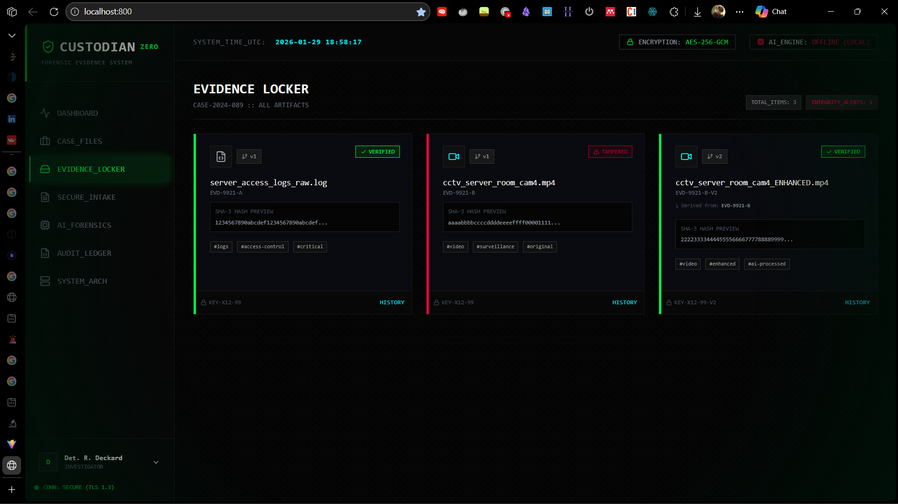
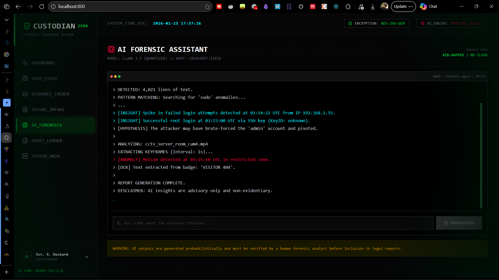

# CUSTODIAN-ZERO EMS

Military-grade **Evidence Management System (EMS)** UI prototype focused on **chain-of-custody**, **secure intake**, **auditability**, and **AI-assisted forensic triage**.





## Project motivation and research scope

Digital forensics workflows depend on preserving **integrity**, **provenance**, and **access accountability** for evidence artifacts (logs, videos, disk images, documents). This project explores a UI-driven EMS concept that:

- Models chain-of-custody events as an append-only sequence.
- Highlights integrity state (verified vs tampered) and version lineage (derived evidence).
- Simulates secure intake (hashing + encryption) and role-based access controls.
- Prototypes “AI Forensics” as an analyst assistant where outputs are explicitly **advisory**.

Research scope (current repo):

- A **frontend prototype** (React + Vite + TypeScript) showcasing screens, flows, and data models.
- **No backend/storage** implementation in this repository (all data is mocked).

## Repository / file structure

This repo is intentionally small and UI-focused.

```text
custodian-zero-ems/
├─ App.tsx                      # Tab router and basic RBAC gating
├─ index.tsx                    # React entry point
├─ index.html                   # Tailwind CDN + app shell
├─ constants.tsx                # Mock users, cases, evidence, audit logs
├─ types.ts                     # Shared TypeScript domain models
├─ components/
│  ├─ Layout.tsx                # App chrome + navigation + role switcher
│  ├─ CaseManagement.tsx        # Case list + create-case stub
│  ├─ EvidenceDashboard.tsx     # Evidence locker + integrity + version cues
│  ├─ EvidenceIntake.tsx        # Secure intake simulation (hash/encrypt)
│  ├─ AIForensics.tsx           # AI terminal-like assistant simulation
│  ├─ AuditLogViewer.tsx        # Audit ledger viewer + filter/search
│  └─ SystemSpecs.tsx           # Architecture/specs screen (conceptual)
├─ ai-forensics.png             # Screenshot
├─ evidence-locker.png          # Screenshot
├─ package.json                 # Vite dev/build scripts
└─ vite.config.ts               # Vite config + env injection
```

## Features and capabilities

### Evidence lifecycle concepts

- Evidence locker view
  - Integrity strip: `VERIFIED` vs `TAMPERED`
  - Hash previews (e.g., SHA-3)
  - Tags for categorization
  - Versioning indicators (derived items reference a `parentId`)

- Secure intake (simulated)
  - Drag-and-drop upload UX
  - Simulated processing progress
  - Mock `SHA-256` generation + “encryption key id” assignment

### Governance and accountability

- Role Based Access Control (RBAC) (demo)
  - User roles: `ADMIN`, `INVESTIGATOR`, `FORENSIC_ANALYST`, `VIEWER`
  - Menu visibility filtered by permissions
  - Tab access gates for sensitive actions (`SECURE_INTAKE`, `AI_FORENSICS`)

- Immutable audit ledger (mock)
  - Search and filter log events
  - Displays “ledger hashes” and access outcomes (e.g., `DENIED`)

### AI-assisted forensics (prototype)

- Terminal-style “AI Forensics Assistant” screen
- Explicit disclaimer: AI outputs are *advisory only and non-evidentiary*
- Intended to represent local/offline inference workflows (UI only here)

## Methodology

This project is a UI prototype built around common digital evidence-handling principles:

- Integrity-first modeling
  - Each evidence item carries hashes (`hashSha256`, `hashSha3`) and an `integrityStatus`.

- Chain-of-custody as an event log
  - Evidence includes a `custodyChain` array with events that simulate an append-only ledger.
  - Each event can link from a `previousHash` to a `newHash` to approximate hash-chaining.

- Evidence version lineage
  - Derived artifacts reference their source via `parentId` (e.g., enhanced video from original).

- RBAC in the UI layer (demo)
  - Permissions control navigation visibility and block restricted screens.

## How to run / setup

### Prerequisites

- Node.js (recommended: latest LTS)
- npm (ships with Node)

### Install

```bash
npm install
```

### Run locally (development)

```bash
npm run dev
```

The Vite dev server is configured to run on `http://localhost:800`.

### Build

```bash
npm run build
```

### Preview production build

```bash
npm run preview
```

### Environment variables

`vite.config.ts` injects `process.env.GEMINI_API_KEY` / `process.env.API_KEY` at build time.

- This UI does **not** currently call Gemini (or any external LLM). The key is optional unless you add networked AI features.
- Keep secrets out of git. Use a local env file such as `.env.local`.

## Limitations

- Prototype-only / no persistence
  - Cases, evidence, custody chain, and audit logs are mocked in `constants.tsx`.

- No cryptography performed
  - Hashing/encryption are simulated for UX; there is no real file storage or key management.

- No backend API / authentication
  - RBAC is UI-side only and not security-enforcing.

- `SystemSpecs` is conceptual
  - The “architecture” screen describes a possible future microservices design, not what exists in this repo today.

## Future improvements

- [ ] Implement a backend (REST/GraphQL) for cases/evidence/custody/audit.
- [ ] Real evidence intake pipeline
  - Streaming upload, hashing during upload, immutable storage, and per-case encryption keys.
- [ ] Append-only audit ledger enforcement
  - DB constraints + WORM storage + signed events (public key verification).
- [ ] AI integration
  - Local inference (e.g., Ollama) or controlled cloud inference with strict privacy policies.
  - Store AI outputs as advisory reports with provenance and reproducibility metadata.
- [ ] Export & reporting
  - Evidence reports with custody chain, integrity proofs, and audit trails.
- [ ] Testing & hardening
  - Unit/integration tests, threat modeling, and secure-by-default configuration.

## Credits

**Kartik Kashyap**<br>
Software Developer<br>
B.Tech Information Technology<br>
Criminology, Forensics & Human-Centered AI Research Enthusiast<br>
Contact: [kartikkashyapworks247@gmail.com](mailto:kartikkashyapworks247@gmail.com)

**Vaibhav Laxmi**<br>
Forensic & Criminology Domain Advisor<br>
B\.Sc. / M\.Sc. Criminology & Forensic Science, NFSU<br>
Contact: [vaibhav.bsmscrfs2242925@nfsu.ac.in](mailto:vaibhav.bsmscrfs2242925@nfsu.ac.in)

---

## 12. License

This project is licensed under the **MIT License**.
See the `LICENSE` file for full terms.