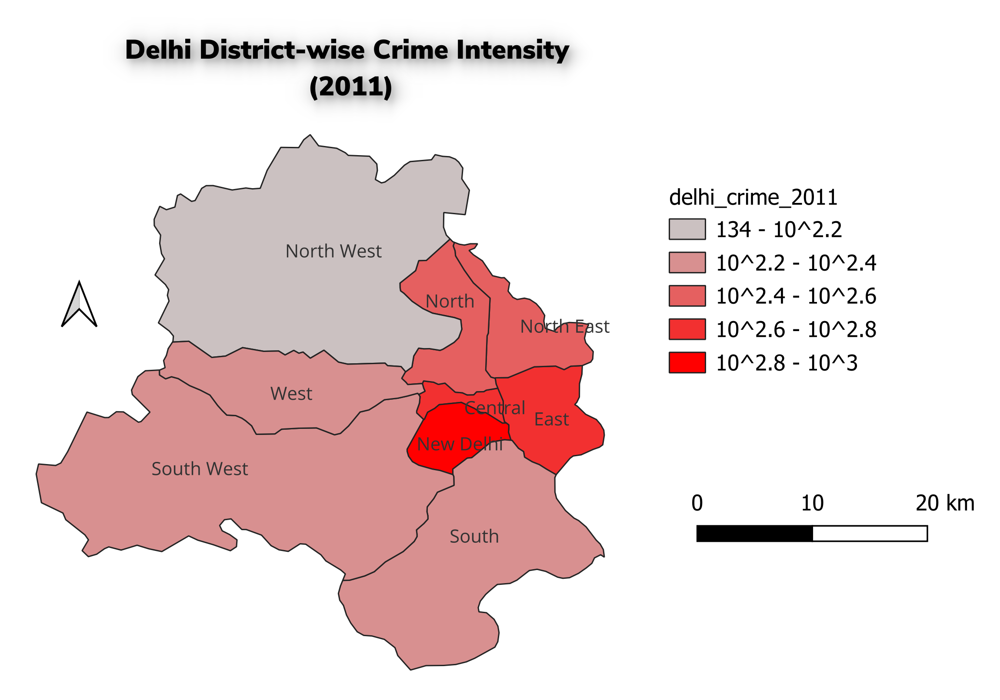
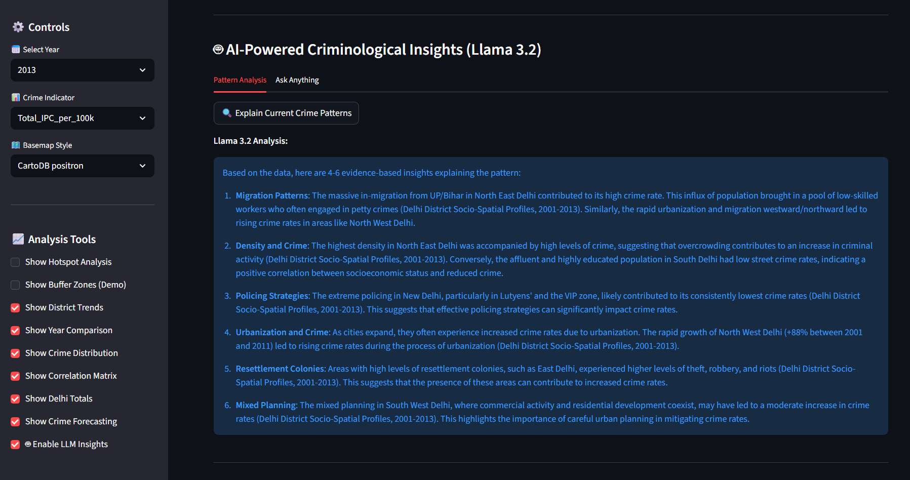

# Delhi Crime Mapping & Analytics (2001–2013)

> **From Static GIS Maps to Interactive, AI‑Assisted Crime Analytics**
> A research‑driven project that combines **official IPC crime data**, **district‑level GIS boundaries**, and **Python‑based spatial analytics** to study crime patterns in Delhi across time.

This repository intentionally contains **multiple approaches** to the *same criminological problem*:

* classical **QGIS cartography** (for academic rigor and map design)
* automated **Python + GeoPandas pipelines** (for scalability and reproducibility)
* an **interactive Streamlit GIS dashboard** (for analysis, exploration, and reporting)

---

## Table of Contents

1. Project Motivation & Research Scope
1. Data Sources & Provenance
2. Repository Structure (What lives where & why)
3. QGIS‑based Analysis (Static Cartographic Workflow)
4. Python GIS Pipeline (Why automation mattered)
5. Interactive Crime Analytics Dashboard (Streamlit + Folium)
6. Methodology & Mathematical Concepts
7. How to Run (Step‑by‑Step)
8. Limitations & Known Gaps
9.  Future Improvements (TODO)
10. Credits
11. License

---

## 1. Project Motivation & Research Scope

Crime mapping is often taught either as:

* *pure GIS cartography* **or**
* *pure data analysis* without spatial reasoning.

This project deliberately bridges both.

### Core research questions

* How does **crime intensity vary spatially** across Delhi districts?
* How do **population and density** change the interpretation of raw crime counts?
* Can district‑level crime data be transformed into **interactive, exploratory intelligence** without violating ethical boundaries?

The study focuses on **2001–2013**, the last period where IPC district‑level definitions remain relatively consistent.

---

## 2. Data Sources & Provenance

### Crime Data (Primary)

* **Source:** data.gov.in
* **Title:** *District‑wise crime under various sections of Indian Penal Code (IPC) crimes during 2001–2013*
* **Coverage:** Murder, Rape, Kidnapping, Robbery, Theft, Riots, Dowry Deaths, and 30+ IPC sections

> ⚠️ Data is aggregated at **district level**. No FIR‑level or point‑location data is used.

### Population Data

* **Source:** Census of India 2011
* **Used for:**

  * crime rate normalization (per 100,000)
  * density‑aware interpretation

### Shapefiles (Spatial Boundaries)

* **Delhi District Boundaries (1997–2012)**
  Source: Hindustan Times Labs
  [https://github.com/HindustanTimesLabs/shapefiles](https://github.com/HindustanTimesLabs/shapefiles)

These boundaries are used consistently across QGIS and Python pipelines to avoid spatial mismatch.

---

## 3. Repository Structure (Intentional Design)

```
MAPPING/
├── dataset/                     # Raw + processed crime & population data
│   ├── pandas-filtering-code/   # Data cleaning, merging, harmonization scripts
│   └── output/                  # Final CSVs used by QGIS & Python GIS
│
├── shapefile/                   # Original shapefiles (districts & wards)
│
├── qgis/                        # Classical GIS workflow
│   ├── 2011_delhi_crime.qgz     # QGIS project
│   ├── Crime_Rate_2011.qpt      # Print layout template
│   ├── CrimeRate_2011.png       # Exported map
│   └── Crime_Rate_2011.pdf
│
├── py-gis/                      # Automated GIS & analytics
│   ├── app.py                   # Streamlit dashboard
│   ├── data/                    # Year-wise GIS-ready CSVs
│   ├── shp/                     # District shapefile (Python copy)
│   ├── main-ui-ss.png           # Dashboard UI snapshot
│   ├── ai-insights-through-district-profiling-ss.png
│   └── temp_map.html            # Auto-generated Folium artifact (non-critical)
│
└── README.md
```

Each folder reflects a **methodological layer**, not redundancy.

---

## 4. QGIS‑Based Analysis (Static Cartographic Workflow)

📄 Project file: [qgis/2011_delhi_crime.qgz](qgis/2011_delhi_crime.qgz)



### What QGIS was used for

* Validating joins between CSV crime data and district shapefiles
* Designing **publication‑quality cartographic layouts**
* Understanding classification schemes (quantiles, graduated colors)

### Layout Template

📄 [qgis/Crime_Rate_2011.qpt](qgis/Crime_Rate_2011.qpt)

The `.qpt` file preserves:

* north arrow, scale bar, legend styling
* color ramps and class breaks
* academic map composition standards

> 💡 While QGIS Python Console *could* automate this, scaling layouts year‑by‑year quickly becomes tedious — motivating the Python GIS pipeline.

---

## 5. Python GIS Pipeline (Why Automation Mattered)

Manually repeating GIS steps for **13 years × multiple crime variables** is:

* time‑intensive
* error‑prone
* hard to reproduce

The Python pipeline solves this.

### Data Harmonization (Pandas)

Scripts in [dataset/pandas-filtering-code](dataset/pandas-filtering-code):

* fix inconsistent district names
* merge IPC files across years
* **exclude 2014 onward** due to incompatible column definitions
* attach 2011 population & density to all years

Example scripts:

* [year_filter_pop.py](dataset/pandas-filtering-code/year_filter_pop.py)
* [merge_updated.py](dataset/pandas-filtering-code/merge_updated.py)

This produces **GIS‑ready, year‑wise CSVs** usable in both QGIS and Python.

---

## 6. Interactive Crime Analytics Dashboard (Python GIS)

📄 Entry point: [py-gis/app.py](py-gis/app.py)


### Core Capabilities

* Choropleth crime maps (Folium + GeoPandas)
* District‑level hotspot classification (quantile‑based)
* Crime rates per 100k population
* Temporal trend comparison (2001–2013)
* Correlation analysis (population, density, crime)
* Forecasting (linear regression; academic demo)
* Auto‑generated **HTML crime analysis reports**

### AI‑Assisted Insights (Optional)



When enabled, a **local LLaMA 3.2 model (Ollama)** provides:

* narrative explanations of spatial crime patterns
* socio‑spatial reasoning support for students

> ⚠️ AI output is **interpretive**, not evidentiary. It is never treated as legal or predictive authority.

---

## 7. Methodology & Mathematical Concepts

### Spatial Analysis

* Choropleth mapping (district aggregation)
* Quantile classification (33rd / 67th percentiles)
* Conceptual buffer zones (patrol influence demo)

### Statistical Methods

* Crime rate normalization: 
$ \text{Rate} = (\text{Crime Count} / \text{Population}) \times 100{,}000 $
* Linear regression for trend direction
* Pearson correlation matrices

### Criminological Framing

* Urbanization & migration effects
* Density vs raw crime fallacy
* Ethical separation of *analysis* vs *prediction*

---

## 8. How to Run

### A. QGIS Workflow

1. Install QGIS (LTR recommended)
2. Open [qgis/2011_delhi_crime.qgz](qgis/2011_delhi_crime.qgz)
3. Ensure CSV paths resolve correctly
4. Export maps via the included layout template

### B. Python GIS Dashboard

```bash
pip install streamlit geopandas folium plotly scipy
streamlit run py-gis/app.py
```

(Optional AI)

```bash
ollama pull llama3.2
ollama serve
```

---

## 9. Limitations & Known Gaps

* District‑level aggregation only (no FIR‑level points)
* Population fixed to Census 2011
* Forecasting is demonstrative, not operational
* 2014+ IPC data excluded due to schema break
* `temp_map.html` is an auto‑generated Folium artifact (safe to ignore)

---

## 10. Future Improvements (TODO)

* [ ] Integrate ward‑level analysis where data permits
* [ ] Add per‑crime‑type spatial autocorrelation (Moran’s I)
* [ ] Replace linear forecasting with spatio‑temporal models
* [ ] Add authentication for restricted forensic mode
* [ ] Support additional Indian cities

---

## 11. Credits


**Kartik Kashyap**<br>
Software Developer<br>
B.Tech Information Technology<br>
Criminology, Forensics & Human-Centered AI Research Enthusiast<br>
Contact: [kartikkashyapworks247@gmail.com](mailto:kartikkashyapworks247@gmail.com)

**Vaibhav Laxmi**<br>
Forensic & Criminology Domain Advisor<br>
B\.Sc. / M\.Sc. Criminology & Forensic Science, NFSU<br>
Contact: [vaibhav.bsmscrfs2242925@nfsu.ac.in](mailto:vaibhav.bsmscrfs2242925@nfsu.ac.in)

---

## 12. License

This project is licensed under the **MIT License**.
See the `LICENSE` file for full terms.


---

> *This project treats crime data not as spectacle, but as evidence — and analysis as responsibility.*
