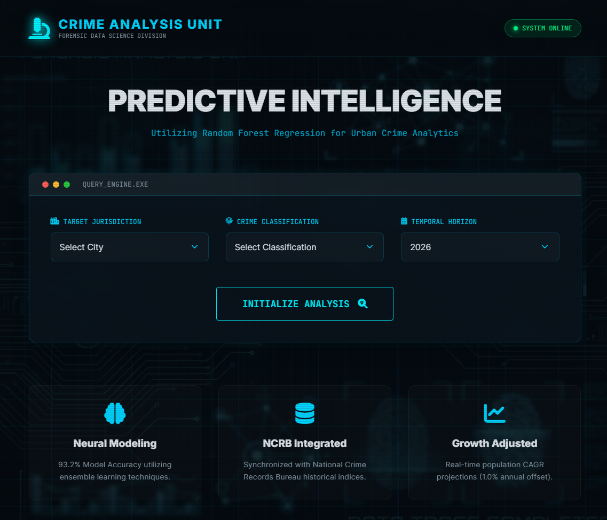

# 🕵️‍♂️ Crime Rate Predictor – Forensic Intelligence Dashboard

[](https://opensource.org/licenses/MIT) [](https://www.python.org/downloads/) [](https://flask.palletsprojects.com/)

> **Predictive crime analytics for academic, forensic, and policy-oriented exploration.**

The **Crime Rate Predictor – Forensic Intelligence Dashboard** is a machine-learning–driven web application that estimates **crime rates (cases per lakh population)** across **19 major Indian metropolitan cities** for selected crime categories and future years.

Built using **Random Forest Regression**, the system integrates **historical crime trends, demographic scaling, and temporal projection** to support **forensic data science education, exploratory analysis, and decision-support simulations**.



---

## 📌 Project Scope & Purpose

This system is designed to:

* Demonstrate **how predictive modeling can be applied to crime data**
* Explore **city-wise and crime-type-wise trends**
* Support **academic learning and forensic analytics projects**
* Serve as a **proof-of-concept dashboard**, not an operational policing tool

⚠ **Important:**
This application does **not** predict individual crimes or guarantee real-world accuracy. Outputs are **statistical estimates**, not actionable intelligence.

---

## 🚀 Key Features

* **Crime Rate Estimation**
  Predicts crime rate (cases per lakh population) for **10 crime categories**, including:

  * Cyber Crimes
  * Economic Offences
  * Crimes against Women
  * Murder
  * Kidnapping

* **Urban & Demographic Scaling**
  Population-adjusted modeling for **19 metropolitan cities**, incorporating a **1% annual CAGR projection** from the 2011 Census baseline.

* **Machine Learning Core**
  Uses **Random Forest Regression** trained on structured historical datasets.

* **Forensic-Themed Dashboard**
  Dark, investigator-style UI with structured analytical output and report-style results.

* **Estimated Case Count**
  Converts predicted crime rate into **approximate total incident count** using adjusted population.

---

## 📊 Dataset & Methodology

### Dataset

* Based on **historical NCRB-style structured crime records**
* Time range: **2014 onwards**
* City-wise and crime-category-wise aggregation

> ⚠ The dataset is **inspired by NCRB formats** but is not an official NCRB release.

---

### Feature Engineering

Model inputs:

* **Year**
* **City (Label Encoded)**
* **Population (in lakhs, growth-adjusted)**
* **Crime Category (Label Encoded)**

Target:

* **Crime Rate (cases per lakh population)**

---

### Population Growth Adjustment

Population is adjusted using a **linear CAGR approximation**:

```
Adjusted Population = Base Population + (0.01 × Year Difference × Base Population)
```

This ensures predictions reflect **urban growth effects**, not static census data.

---

### Machine Learning Model

* **Algorithm:** Random Forest Regressor
* **Framework:** Scikit-learn
* **Training/Test Split:** 80 / 20
* **Evaluation Metric:** Regression accuracy (dataset-dependent)

> The reported accuracy reflects **training performance on historical data**, not real-world predictive certainty.

---

## 🛠️ Installation & Setup

### 1️⃣ Clone the Repository

```bash
git clone https://github.com/KartikKashyap-v/Crime-Rate-Prediction.git
cd Crime-Rate-Prediction
```

### 2️⃣ Install Dependencies

```bash
pip install -r requirements.txt
```

### 3️⃣ Run the Application

```bash
python app.py
```

Access the dashboard at:

```
http://127.0.0.1:5000
```

---

## 📂 Project Structure

```
Crime-Rate-Prediction/
│
├── app.py                # Flask application & inference logic
├── regenerate_model.py   # Model training & regeneration
├── crp.ipynb             # Jupyter notebook
│
├── Model/
│   └── model.pkl         # Serialized Random Forest model
│
├── Dataset/
│   └── new_dataset.xlsx  # Structured crime dataset
│
├── static/
│   ├── css/              # UI styling
|   ├── images/           # Favicons and logo  
│   └── main.js           # Frontend interactivity
│
└── templates/
    ├── index.html        # Input dashboard
    └── result.html       # Forensic-style report view
```

---

## ⚠ Limitations

* Uses **aggregated historical data**, not real-time feeds
* Assumes **uniform population growth**
* No spatial (GIS) granularity
* No uncertainty intervals or confidence bounds
* Not validated for legal or operational decision-making
* Crime dynamics are influenced by factors not modeled (policy, migration, reporting bias)

---

## 🚧 Future Improvements

* [ ] Integrate real NCRB open datasets with citations
* [ ] Add confidence intervals and prediction uncertainty
* [ ] Incorporate GIS-based spatial analysis
* [ ] Add temporal trend visualizations
* [ ] Support additional cities and rural districts
* [ ] Enable exportable forensic reports (PDF)
* [ ] Introduce explainability (feature importance dashboards)

---

## 👤 Credits

**Kartik Kashyap**<br>
Software Developer<br>
B.Tech Information Technology<br>
Criminology, Forensics, and Human-Centered AI Research Enthusiast<br>
Contact: [kartikkashyapworks247@gmail.com](mailto:kartikkashyapworks247@gmail.com)<br>

**Vaibhav Laxmi**<br>
Forensic & Criminology Domain Advisor<br>
B\.Sc. M\.Sc. Criminology & Forensic Science, NFSU<br>
Contact: [vaibhav.bsmscrfs2242925@nfsu.ac.in](mailto:vaibhav.bsmscrfs2242925@nfsu.ac.in)<br>

---

## 📜 License

**MIT License**

This project is open for:

* Learning
* Modification
* Academic and research use

---

## 📎 Disclaimer

This tool is intended **solely for educational, academic, and analytical purposes**.
For official crime statistics and legal reference, consult the **National Crime Records Bureau (NCRB), Government of India**.