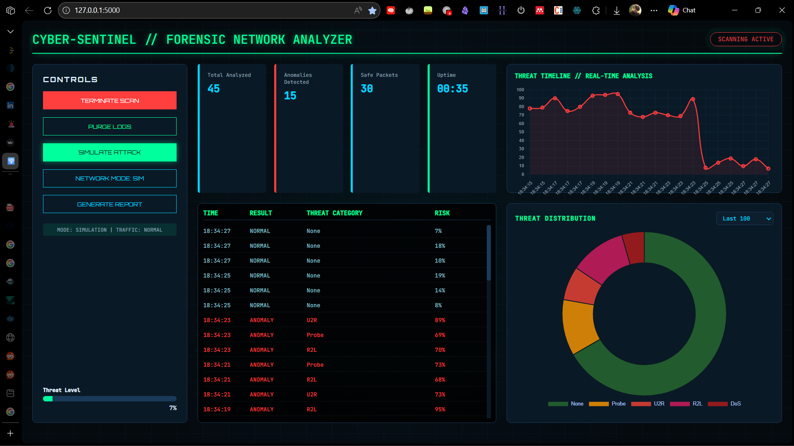

# 🛡️ CYBER-SENTINEL

## Network Anomaly Detection & Forensic Threat Analysis System

[](https://opensource.org/licenses/MIT) [](https://www.python.org/downloads/) [](https://flask.palletsprojects.com/)

> **A forensic-grade network anomaly detection system with real-time simulation, threat classification, visual analytics, and automated incident reporting.**



---

## 📌 Overview

**CYBER-SENTINEL** is a **network anomaly detection and forensic analysis platform** that combines:

* Machine learning–based intrusion detection
* Controlled attack simulation
* Real-time visual analytics
* Risk scoring and threat categorization
* Automated forensic PDF reporting

The system is designed primarily for **cyber forensics education, research demonstrations, and controlled lab simulations**, rather than live enterprise deployment.

---

## 🎯 Purpose & Research Scope

### Why this project exists

Most introductory network anomaly detection projects:

* Stop at model inference
* Lack forensic interpretability
* Do not show *how incidents evolve over time*

CYBER-SENTINEL was built to:

* Demonstrate **end-to-end forensic network monitoring**
* Show how **ML predictions translate into incidents**
* Visualize **risk escalation and threat distribution**
* Bridge **cybersecurity + digital forensics + explainability**

---

## 🧠 System Capabilities

### Core Functionalities

* **Anomaly Detection using ML**

  * Uses a pre-trained pipeline (KDD-style feature space)
  * Differentiates between:

    * Normal traffic
    * DoS
    * Probe
    * R2L (Remote-to-Local)
    * U2R (User-to-Root)

* **Dual Network Modes**

  * **Simulation Mode** (default, deterministic & demonstrative)
  * **Live Mode** (optional, psutil-based system stats)

* **Attack Simulation Engine**

  * Toggleable attack states
  * Generates realistic attack signatures
  * Enables controlled forensic demonstrations

* **Risk Scoring**

  * Confidence-based risk percentage
  * Visual risk meter with critical thresholds

---

## 🏗️ Architecture

```
Traffic Source
   ├── Simulation Generator
   └── Live Network Stats (optional)
          ↓
Feature Normalization & Encoding
          ↓
ML Pipeline (Preprocessor + Model)
          ↓
Threat Classification & Risk Scoring
          ↓
Visual Analytics (Timeline, Donut, Logs)
          ↓
Forensic Incident Report (PDF)
```

All inference and visualization run via a **Flask-based backend** with a **forensic-style HTML dashboard**.

---

## 🔬 Machine Learning Methodology

* **Dataset**:

  * KDD Cup–style intrusion detection dataset
  * Feature space: 41 attributes (categorical + numerical)

* **Pipeline Components**:

  * Column-wise preprocessing
  * One-hot encoding for categorical features
  * Supervised classification model

* **Prediction Output**:

  * Binary anomaly detection
  * Multi-class threat categorization (mapped post-prediction)

⚠ **Important:**
The model is trained for **pattern recognition**, not zero-day detection or enterprise-grade IDS accuracy.

---

## 📊 Visual Analytics

### 1. Threat Timeline

* Rolling risk-score line chart
* Highlights escalation patterns
* Dynamic color shift for critical risk levels

### 2. Threat Distribution (Donut Chart)

* Breakdown of detected traffic types
* Adjustable window (last 50 / 100 / 200 packets)

### 3. Forensic Event Log

* Timestamped packet-level decisions
* Prediction, threat class, and risk score
* Flicker & color cues for anomalies

---

## 📄 Automated Forensic Reporting

CYBER-SENTINEL can generate **court-style forensic PDF reports** containing:

* System metadata
* Analysis duration
* Network & simulation mode
* Threat timeline visualization
* Threat distribution chart
* Statistical summary
* Recent high-risk incidents
* Human-readable forensic conclusion

Reports are generated using **ReportLab** and **Matplotlib** (server-side).

---

## 🛠️ Installation & Setup

### Prerequisites

* Python **3.9+**
* pip
* Optional: `psutil` (for live network mode)

### Clone Repository

```bash
git clone https://github.com/webpro255/network-anomaly-detection.git
cd network-anomaly-detection
```

### Install Dependencies

```bash
pip install -r requirements.txt
```

### Run the Application

```bash
python app.py
```

Access dashboard at:

```
http://127.0.0.1:5000
```

---

## 🧪 Simulation Controls

| Control         | Function                     |
| --------------- | ---------------------------- |
| Initialize Scan | Start / stop packet analysis |
| Simulate Attack | Toggle malicious traffic     |
| Network Mode    | Switch between SIM / LIVE    |
| Generate Report | Export forensic PDF          |
| Purge Logs      | Clear runtime logs           |

---

## 📂 Project Structure

```
.
├── app.py                    # Flask backend & simulation engine
├── anomaly_detection.py      # Legacy detection interface
├── inspect_pipeline.py       # Pipeline debugging utility
├── pipeline.pkl              # Trained ML pipeline
├── kddcup.data_10_percent    # Reference dataset
├── requirements.txt
├── set_path.sh
│
├── templates/
│   └── index.html            # Forensic dashboard UI
```

---

## ⚠ Limitations

* Primarily simulation-driven
* Live mode uses coarse system metrics
* Dataset is dated (KDD-style)
* No encrypted packet payload inspection
* No distributed or high-throughput capture
* Not a replacement for Snort / Suricata / Zeek

---

## 🚧 Future Improvements

* [ ] Integrate real packet capture (pcap parsing)
* [ ] Add deep learning–based anomaly models
* [ ] Introduce MITRE ATT&CK mapping
* [ ] Add alert severity levels & escalation logic
* [ ] Persistent incident database
* [ ] Multi-host network simulation
* [ ] Signed & hash-verified forensic reports

---

## ⚖️ Ethical & Legal Considerations

* Designed for **education and research**
* Not intended for unauthorized network monitoring
* Should only be used on networks you own or are permitted to analyze
* Outputs must not be treated as legal evidence without validation

---

## 👤 Credits

**Kartik Kashyap**<br>
Software Developer<br>
B.Tech Information Technology<br>
Criminology, Forensics & Human-Centered AI Research Enthusiast<br>
Contact: [kartikkashyapworks247@gmail.com](mailto:kartikkashyapworks247@gmail.com)

**Vaibhav Laxmi**<br>
Forensic & Criminology Domain Advisor<br>
B\.Sc. / M\.Sc. Criminology & Forensic Science, NFSU<br>
Contact: [vaibhav.bsmscrfs2242925@nfsu.ac.in](mailto:vaibhav.bsmscrfs2242925@nfsu.ac.in)

---

## 📜 License

MIT License
See the `LICENSE` file for full terms.