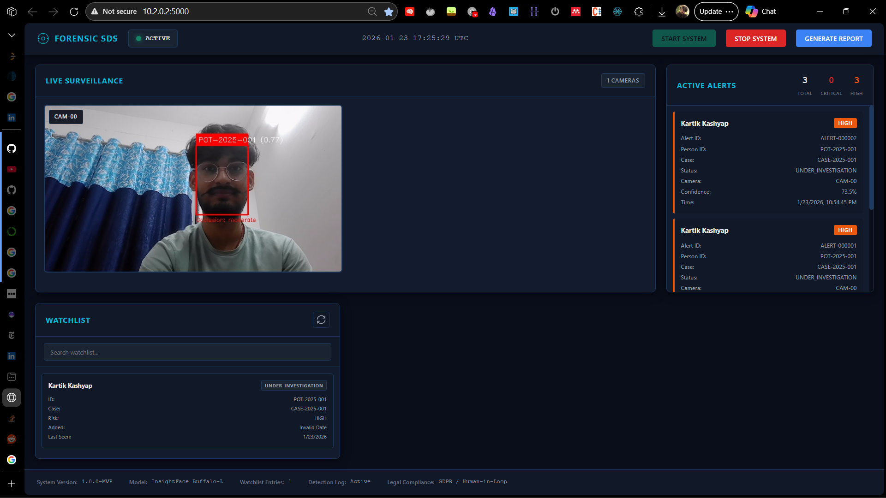

# Forensic Suspect Detection System (SDS)

**Version:** 1.0.0-MVP  
**Purpose:** Human-in-the-loop suspect detection for airports, land ports, and high-security zones  
**Status:** Forensic-grade, probabilistic, explainable


*(System in Action)*

---

## 🎯 CRITICAL PRINCIPLES

### Human-in-the-Loop (MANDATORY)
- ✅ System **assists** investigators - it does NOT accuse
- ✅ All matches are **probabilistic** with confidence scores
- ✅ **No public alerts** - internal control room only
- ✅ Requires **human verification** before any action
- ✅ No automated punishment, exposure, or public shaming

### Legal & Ethical Safeguards
- ✅ GDPR compliant mode available
- ✅ Audit logging for every operation
- ✅ Case-based authorization required
- ✅ Evidence integrity via cryptographic hashing
- ✅ Respects presumption of innocence

---

## 📋 SYSTEM OVERVIEW

The Forensic Suspect Detection System is a complete refactoring of facial recognition attendance software into a forensic-grade detection platform for law enforcement and security operations.

### Key Capabilities

1. **Real-Time Detection**
   - Multi-camera simultaneous processing
   - Face detection with occlusion handling
   - Mask detection support
   - Pose-invariant recognition

2. **Watchlist Management**
   - Legal status tracking (WANTED, POI, MISSING, etc.)
   - Risk level classification (CRITICAL, HIGH, MEDIUM, LOW)
   - Case-based organization
   - Agency authorization controls

3. **Post-Incident Tracing**
   - Backtrack suspect movement through recorded footage
   - Historical video analysis
   - Timeline generation with confidence scores
   - Evidence frame extraction

4. **Forensic Logging**
   - Append-only audit logs
   - Frame hashing for integrity verification
   - Detection metadata preservation
   - Legal chain-of-custody support

5. **SOC-Style Control Interface**
   - Dark theme security operations center dashboard
   - Real-time camera feeds
   - Live alert monitoring
   - Watchlist management
   - System status tracking

---

## 🏗️ SYSTEM ARCHITECTURE

Refer [ARCHITECTURE.md](ARCHITECTURE.md) for detailed documentation.

**Folder structure:**

```
suspect_detection_system/
├── config.py                 # System configuration & parameters
├── app.py                    # Flask web application
├── requirements.txt          # Python dependencies
│
├── core/                     # Core detection modules
│   ├── watchlist.py         # Watchlist management
│   ├── recognition.py       # Face detection & recognition engine
│   ├── alerts.py            # Alert system & post-incident tracer
│   └── camera.py            # Multi-camera management
│
├── gui/                      # Web interface
│   ├── templates/
│   │   └── dashboard.html   # Main dashboard UI
│   └── static/
│       ├── css/
│       │   └── dashboard.css # SOC-style dark theme
│       └── js/
│           └── dashboard.js  # Real-time updates
│
├── data/                     # Data storage
│   ├── watchlist.csv        # Suspect database
│   ├── watchlist_embeddings.pkl  # Face embeddings
│   ├── cases.csv            # Case information
│   └── images/              # Training images
│       └── PersonID_XXX/    # One folder per person
│
├── logs/                     # System logs
│   ├── detections.log       # All detections
│   ├── alerts.log           # Alert events
│   ├── system.log           # System operations
│   └── audit.log            # Audit trail
│
├── evidence/                 # Forensic evidence
│   ├── alert_frames/        # Captured alert frames
│   └── suspect_traces/      # Post-incident analysis reports
│
└── utils/                    # Utility scripts
    ├── add_person.py        # Add person to watchlist
    ├── build_embeddings.py  # Build embeddings database
    └── analyze_video.py     # Post-incident video analysis
```

---

## 🚀 INSTALLATION & SETUP

Refer [QUICKSTART.md](QUICKSTART.md) for detailed guide.

### Prerequisites
- Python 3.8+
- Webcam or IP cameras (RTSP support)
- GPU recommended (CUDA compatible) for real-time processing
- 8GB+ RAM

### Step 1: Install Dependencies

```bash
# Create virtual environment (recommended)
python -m venv venv
source venv/bin/activate  # On Windows: venv\Scripts\activate

# Install requirements
pip install -r requirements.txt
```

### Step 2: Download InsightFace Model

InsightFace will automatically download the buffalo_l model on first run. Ensure internet connection for initial setup.

### Step 3: Initialize System

```bash
# System will auto-create required directories
python app.py
```

---

## 📝 USAGE GUIDE

### 1. Add Person to Watchlist

```bash
python utils/add_person.py
```

Follow interactive prompts to enter:
- Person ID (e.g., POI-2025-001)
- Case ID
- Full name
- Risk level (CRITICAL, HIGH, MEDIUM, LOW, REVIEW)
- Legal status (WANTED, POI, MISSING, WITNESS, UNDER_INVESTIGATION)
- Authorized agency
- Officer name
- Notes

### 2. Prepare Training Images

**Option A: Live Webcam Capture (Recommended for Law Enforcement)**

```bash
python utils/collect_samples.py
```

**Interactive workflow:**
1. System displays watchlist
2. Select person to collect samples for
3. Choose number of photos (default: 50 per mode)
4. **Phase 1: Normal Face**
   - Camera opens with live preview
   - Subject looks at camera
   - Slowly rotates head (left, right, up, down)
   - System auto-captures at intervals
   - Progress bar shows completion
5. **Phase 2: Masked Face**
   - Subject puts on mask/covering
   - Repeats head movements
   - System captures masked variations
6. Photos saved to: `data/images/PersonID/normal/` and `data/images/PersonID/masked/`

**Command line usage:**
```bash
# Collect 50 photos per mode for specific person
python utils/collect_samples.py POI-2025-001

# Collect 100 photos per mode
python utils/collect_samples.py POI-2025-001 100
```

**Best practices:**
- Good, even lighting on face
- Plain background preferred
- Subject should move slowly
- Capture various head angles (±45° rotation)
- Include slight variations in distance
- Total time: ~2-3 minutes per person

**Option B: Manual Image Upload**

Organize images in the following structure:

```
data/images/
├── POI-2025-001/
│   ├── normal/
│   │   ├── photo1.jpg
│   │   ├── photo2.jpg
│   │   └── ...
│   └── masked/
│       ├── photo1.jpg
│       └── ...
├── POI-2025-002/
│   ├── normal/
│   └── masked/
```

**Image Requirements:**
- Format: JPG, JPEG, or PNG
- Minimum 5 images per mode (10-20 recommended, 50 optimal)
- Clear frontal face visible
- Various conditions (lighting, angles)
- Both masked and unmasked folders required

### 3. Build Embeddings Database

```bash
python utils/build_embeddings.py
```

This extracts facial embeddings from all images and creates the recognition database.

### 4. Start the System

```bash
python app.py
```

Access the web interface at: **http://localhost:5000**

### 5. Real-Time Detection

1. Click **"START SYSTEM"** in the web interface
2. System auto-detects available cameras
3. Live feeds display with detection overlays
4. Alerts appear in the center panel for matches
5. Click **"STOP SYSTEM"** to halt detection

### 6. Post-Incident Video Analysis

```bash
python utils/analyze_video.py
```

Follow prompts to:
- Select video file
- Choose suspect from watchlist
- Optionally save annotated output
- Generate timeline report

---

## ⚙️ CONFIGURATION

Edit `config.py` to customize:

### Detection Parameters
```python
MATCH_CONFIDENCE_THRESHOLD = 0.55  # Matching threshold
HIGH_CONFIDENCE_THRESHOLD = 0.70   # High-priority alerts
ADJUST_THRESHOLD_FOR_OCCLUSION = True  # Dynamic adjustment
```

### Occlusion Handling
```python
OCCLUSION_DETECTION_ENABLED = True
OCCLUSION_CONFIDENCE_PENALTY = {
    "none": 0.0,
    "mild": 0.05,
    "moderate": 0.10,
    "severe": 0.15
}
```

### Camera Settings
```python
MAX_CAMERAS = 8
DEFAULT_CAMERA_FPS = 10  # Process 10 frames/second
```

### Alert System
```python
ALERT_COOLDOWN_SECONDS = 300  # 5 minutes between alerts
MAX_ALERTS_PER_HOUR = 50
```

---

## 🔒 ETHICAL & LEGAL SAFEGUARDS

### Privacy Protection
- **Face Blurring:** Non-matches can be blurred (configurable)
- **Data Retention:** Automatic anonymization after investigation period
- **Access Control:** Agency-based authorization required

### Legal Compliance
- **GDPR Mode:** Available for European operations
- **Audit Trail:** Complete logging of all operations
- **Justification Required:** Every watchlist entry requires case number
- **Chain of Custody:** Cryptographic frame hashing for evidence

### Human Oversight
- **No Automation:** System never takes action without human approval
- **Confidence Scores:** Always displays probabilistic nature
- **Review Required:** High-risk matches require supervisor approval
- **Right to Challenge:** All detections can be disputed

### Bias Mitigation
- **Pretrained Models:** Uses InsightFace buffalo_l (tested across demographics)
- **Threshold Transparency:** Clear confidence scores shown
- **Quality Metrics:** Occlusion level and detection quality tracked

---

## 🚨 LIMITATIONS & FALSE POSITIVE HANDLING

### Known Limitations

1. **Occlusion Impact**
   - Heavy occlusion (>60%) reduces accuracy
   - System adjusts thresholds but may miss heavily obscured faces

2. **Lighting Conditions**
   - Extreme lighting (very dark/bright) affects detection
   - Infrared cameras recommended for night operations

3. **Video Quality**
   - Low resolution (<480p) impacts accuracy
   - Compression artifacts reduce recognition quality

4. **Database Size**
   - Accuracy improves with more reference images
   - Minimum 5 images recommended per person

5. **Pose Variation**
   - Profile views (>45° angle) less reliable than frontal
   - Multiple angle training images improve robustness

### False Positive Management

**If a false positive occurs:**

1. **Immediate Response**
   - Human verification ALWAYS required before action
   - Review confidence score and occlusion level
   - Check alert frame quality

2. **Investigation**
   - Compare alert frame with reference images
   - Review detection metadata
   - Check for similar-looking individuals

3. **System Adjustment**
   - Increase confidence threshold if too many false positives
   - Add more diverse training images
   - Review lighting and camera positioning

4. **Documentation**
   - Log false positive in system
   - Note contributing factors
   - Update training data if needed

### Confidence Score Interpretation

- **0.70+** (High): Strong match, proceed with verification
- **0.55-0.69** (Medium): Possible match, requires careful review
- **0.45-0.54** (Low): Weak match, likely false positive
- **<0.45**: Not a match

---

## 📊 PERFORMANCE CONSIDERATIONS

### Hardware Recommendations

**Minimum (Demo/Testing):**
- CPU: 4+ cores
- RAM: 8GB
- Storage: 50GB
- Network: 100 Mbps

**Recommended (Production):**
- CPU: 8+ cores
- RAM: 16GB+
- GPU: NVIDIA with 4GB+ VRAM (CUDA compatible)
- Storage: 500GB+ SSD
- Network: 1 Gbps

### Processing Speed

- **Real-time:** 10 FPS per camera (configurable)
- **Post-incident:** Processes 2 frames/second of video
- **Embedding extraction:** ~0.1 seconds per image

### Scalability

- **Cameras:** Up to 8 simultaneous feeds (configurable to MAX_CAMERAS)
- **Watchlist:** Tested with 100+ persons
- **Video Analysis:** Handles videos up to several hours

---

## 🛠️ TROUBLESHOOTING

### Camera Not Detected
```bash
# Test camera detection
python -c "from core.camera import CameraManager; print(CameraManager.detect_available_cameras())"
```

### InsightFace Model Download Issues
- Ensure internet connection
- Check firewall/proxy settings
- Model downloads to `~/.insightface/models/`

### Low Detection Accuracy
1. Add more training images (10-20 per person)
2. Ensure images show clear frontal faces
3. Include variety: lighting, angles, expressions
4. Lower confidence threshold in config.py

### High False Positive Rate
1. Increase MATCH_CONFIDENCE_THRESHOLD
2. Improve training image quality
3. Check camera positioning and lighting
4. Enable occlusion penalty adjustments

### Performance Issues
1. Reduce DEFAULT_CAMERA_FPS
2. Decrease MAX_CAMERAS
3. Enable GPU acceleration (check GPU_ENABLED in config.py)
4. Use lower resolution cameras

---

## 📞 OPERATIONAL GUIDELINES

### Deployment Checklist

- [ ] Legal authorization obtained for deployment
- [ ] Privacy impact assessment completed
- [ ] Staff trained on human verification procedures
- [ ] Audit logging enabled and monitored
- [ ] Data retention policies configured
- [ ] Incident response plan established
- [ ] Regular accuracy audits scheduled

### Daily Operations

1. **System Start**
   - Verify camera connectivity
   - Check watchlist is current
   - Confirm alert systems functioning

2. **During Operation**
   - Monitor alert panel continuously
   - Verify all detections before action
   - Log any system issues immediately

3. **Alert Response**
   - Human verification required for EVERY alert
   - Cross-reference with additional identification
   - Document decision and reasoning
   - Follow agency protocols for confirmed matches

4. **System Shutdown**
   - Stop all camera feeds
   - Verify logs are intact
   - Back up evidence files
   - Document any incidents

### Maintenance

- **Daily:** Check logs, verify system operation
- **Weekly:** Review false positive rate, update watchlist
- **Monthly:** Audit trail review, accuracy assessment
- **Quarterly:** System updates, staff retraining

---

## 🔬 TECHNICAL DETAILS

### Face Detection Model
- **Model:** InsightFace Buffalo-L
- **Architecture:** ResNet-based
- **Embedding Dimension:** 512
- **Distance Metric:** Cosine similarity

### Recognition Pipeline
1. Frame capture from camera
2. Face detection (bounding box)
3. Embedding extraction (512-dim vector)
4. Occlusion estimation
5. Similarity computation against watchlist
6. Threshold comparison with dynamic adjustment
7. Alert generation (if match + cooldown satisfied)

### Security Features
- Frame hashing: SHA-256
- Append-only logs
- Access control by agency
- Encrypted evidence storage (optional)

---

## 📄 LICENSE & LEGAL

MIT License
See the `LICENSE` file for full terms.

### Usage Restrictions
This system is designed EXCLUSIVELY for:
- Law enforcement investigations
- Airport security operations
- Border control with legal authority
- Missing person searches

### Prohibited Uses
- ❌ Mass surveillance without legal authority
- ❌ Targeting based on protected characteristics
- ❌ Social credit systems
- ❌ Discriminatory profiling
- ❌ Predictive policing without oversight

### Liability
- System provides assistance only - humans make final decisions
- Operators responsible for verification and actions taken
- False positives are inevitable - proper procedures mandatory
- Developers not liable for misuse or operational decisions

---

## 🆘 SUPPORT & CONTACT

### System Information
- Version: 1.0.0-MVP
- Model: InsightFace Buffalo-L
- Compliance: GDPR, Human-in-Loop, Chain-of-Custody

### Documentation
- Configuration: `config.py`
- API Reference: Flask routes in `app.py`
- Logs: `logs/` directory

---

## 👤 Credits

**Kartik Kashyap**<br>
Software Developer<br>
B.Tech Information Technology<br>
Criminology, Forensics & Human-Centered AI Research Enthusiast<br>
Contact: [kartikkashyapworks247@gmail.com](mailto:kartikkashyapworks247@gmail.com)

**Vaibhav Laxmi**<br>
Forensic & Criminology Domain Advisor<br>
B\.Sc. / M\.Sc. Criminology & Forensic Science, NFSU<br>
Contact: [vaibhav.bsmscrfs2242925@nfsu.ac.in](mailto:vaibhav.bsmscrfs2242925@nfsu.ac.in)

---

## ⚖️ FINAL REMINDERS

**This system assists investigators. It does NOT:**
- Accuse individuals
- Make arrest decisions
- Punish suspects
- Expose people publicly
- Replace human judgment

**Human verification is MANDATORY for every detection.**

**Respect privacy. Respect rights. Respect dignity.**

---

*Built with ethical AI principles and legal safeguards.*