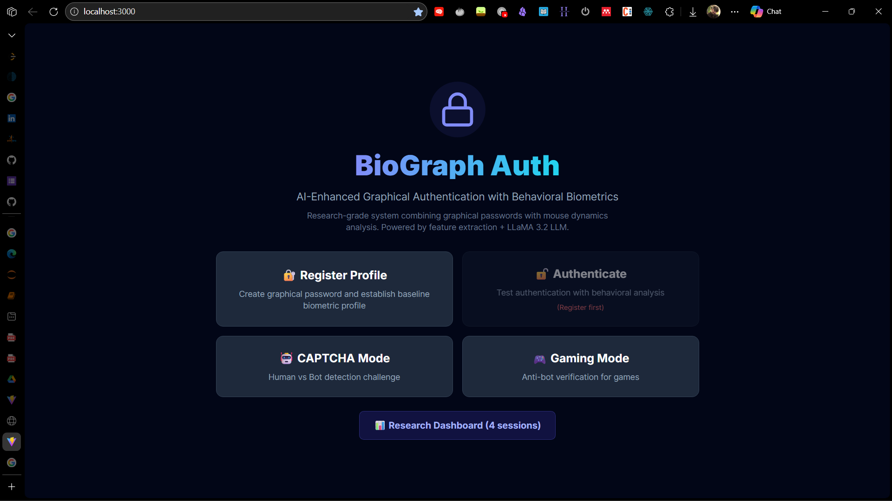
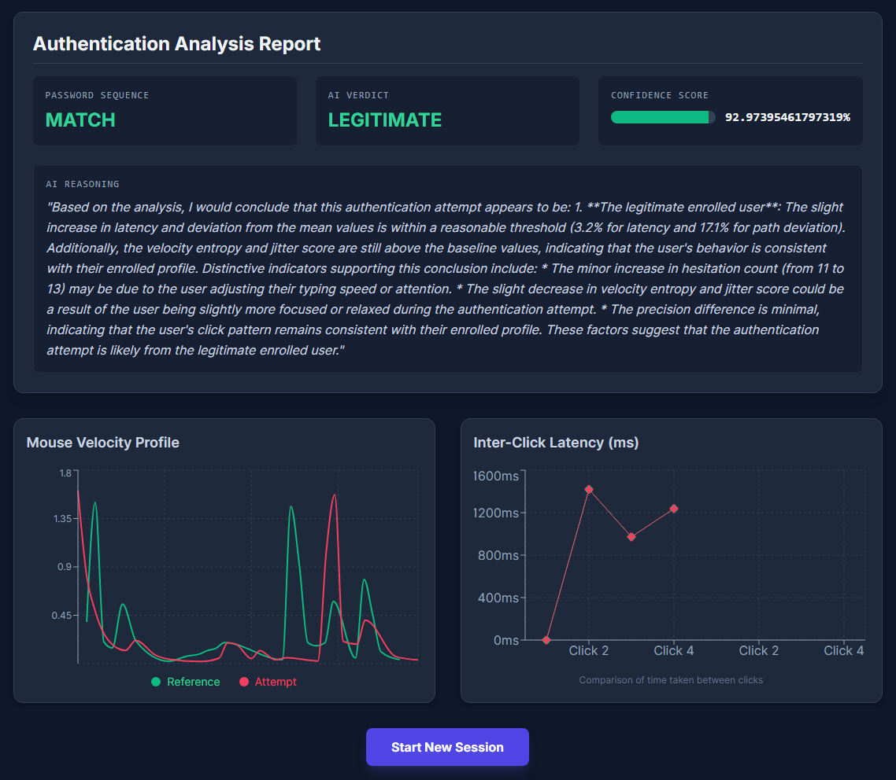
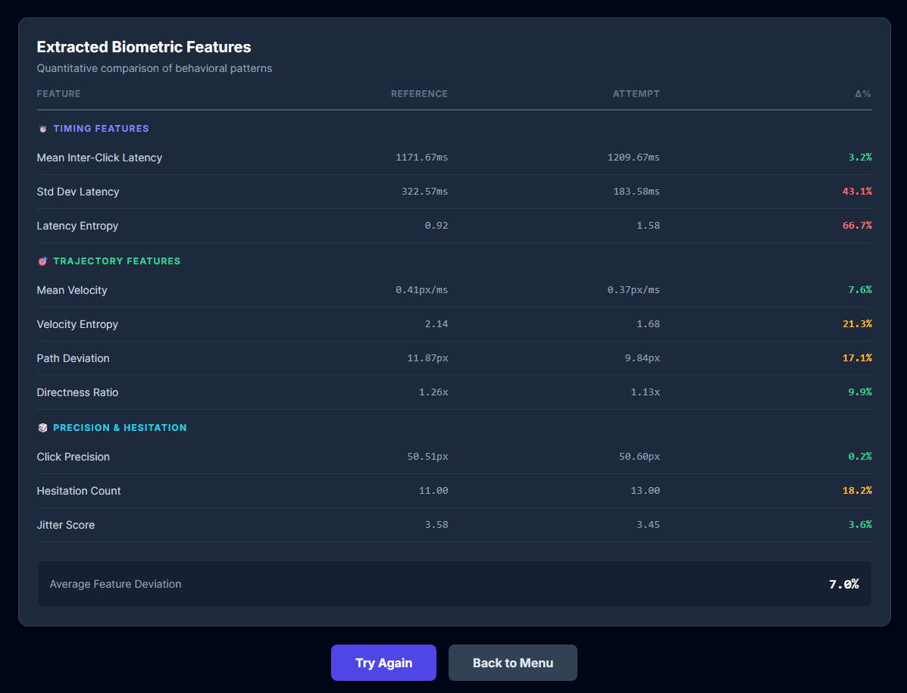
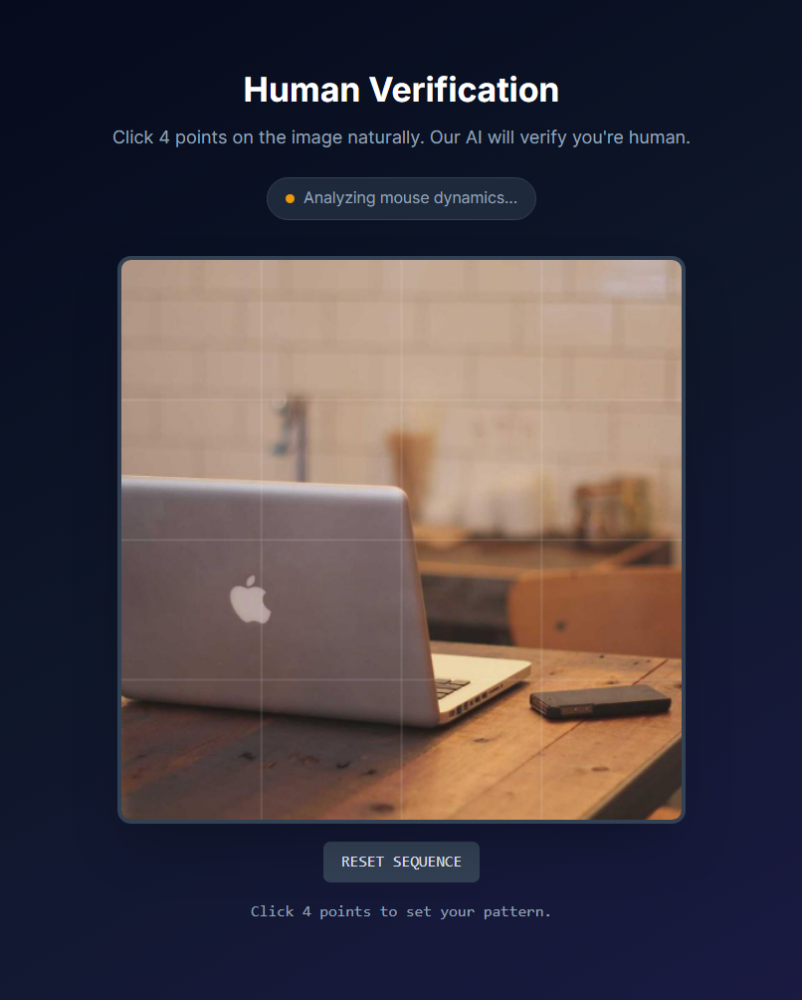
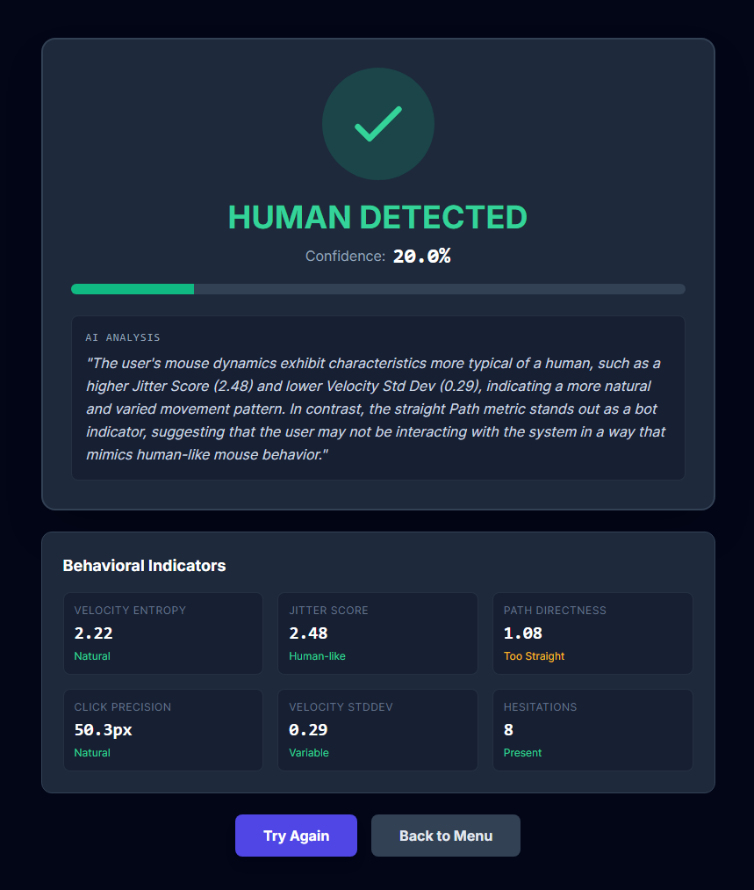
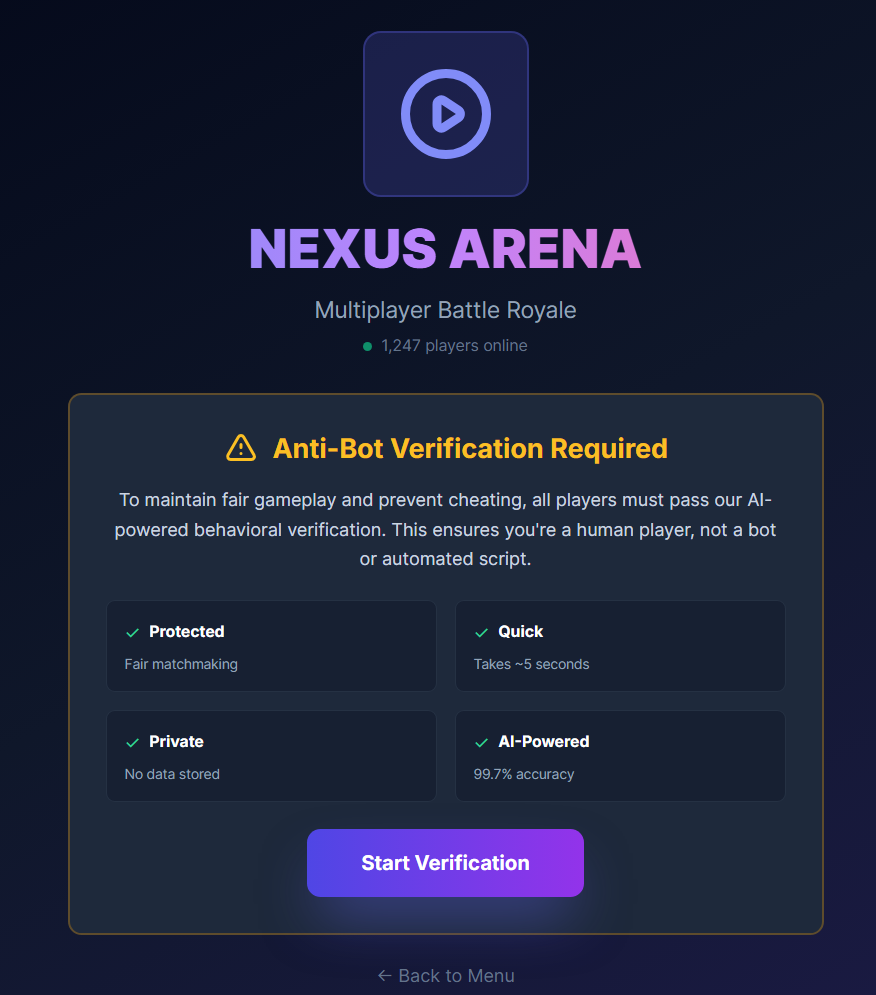
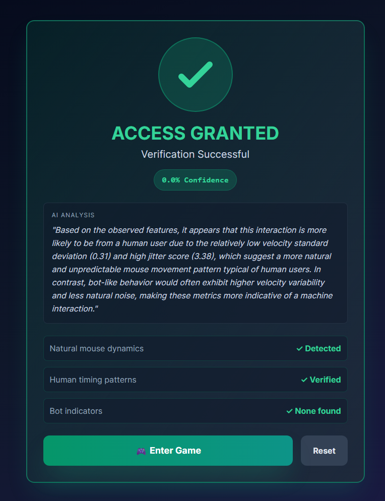

# BioGraph Auth: AI-Enhanced Graphical Authentication with Behavioral Biometrics

## Overview

**BioGraph Auth** is a research-grade authentication system that combines **graphical passwords** with **behavioral biometric analysis** to detect anomalous authentication attempts. Unlike traditional graphical passwords that rely solely on "what you know," BioGraph Auth adds a layer of "how you authenticate" by analyzing mouse dynamics, timing patterns, and trajectory characteristics.

The system integrates **local LLM reasoning** (LLaMA 3.2 via Ollama) to provide human-readable explanations of authentication decisions, making it suitable for security research, human-computer interaction studies, and educational demonstrations.



---

## Research Motivation

### Why Graphical Authentication?

Traditional alphanumeric passwords suffer from:
- **Memorability vs Security Trade-off**: Strong passwords are hard to remember
- **Vulnerability to Shoulder-Surfing**: Passwords can be observed
- **Reuse Across Services**: Users tend to reuse passwords

Graphical passwords offer:
- **Higher Memorability**: Humans remember images better than text
- **Resistance to Dictionary Attacks**: No linguistic patterns to exploit
- **Increased Password Space**: Spatial combinations exceed typical text passwords

### Why Behavioral Biometrics?

Even if an attacker obtains the correct graphical password through:
- **Shoulder-surfing** (observing the user)
- **Social engineering**
- **Video recording**

They cannot easily replicate the user's unique **kinetic signature**, which includes:
- **Inter-click timing patterns** (rhythm and hesitation)
- **Mouse velocity profiles** (acceleration and deceleration)
- **Path characteristics** (curvature vs straight lines)
- **Precision metrics** (click accuracy and jitter)

### Why AI Explainability?

Security systems often operate as "black boxes," rejecting authentication attempts without explanation. By integrating LLaMA 3.2:
- **Transparency**: Users understand *why* they were flagged
- **Trust**: Clear reasoning builds confidence in the system
- **Research Value**: Enables analysis of attack patterns
- **Education**: Demonstrates AI reasoning in security contexts

---

## Project Structure

```
biograph-auth/
├── App.tsx                          # Main application orchestrator
├── types.ts                         # TypeScript type definitions
├── components/
│   ├── AuthCanvas.tsx              # Click-based graphical password input
│   ├── BiometricAnalysis.tsx       # Results visualization with charts
│   ├── FeatureExtractor.tsx        # Detailed feature comparison display
│   ├── SimulationControl.tsx       # Attack mode selection interface
│   ├── CaptchaMode.tsx             # Human vs Bot detection challenge
│   ├── GamingMode.tsx              # Gaming anti-bot verification demo
│   └── ResearchDashboard.tsx       # Session logs and analytics
├── services/
│   ├── featureExtraction.ts        # Biometric feature computation
│   ├── llmService.ts               # LLaMA 3.2 integration via Ollama
│   └── simulationEngine.ts         # Attack pattern generation
└── public/
    └── img.jpg                     # Authentication image
```

---

## Features & Capabilities

### 🔐 Core Authentication

- **4x4 Grid-Based Graphical Password**: Click sequence on image
- **Mouse Trajectory Capture**: Continuous path recording
- **Behavioral Feature Extraction**: 16+ biometric metrics
- **Dual Verification**: Password correctness + behavioral match


### 📊 Behavioral Analysis

**Timing Features:**
- Mean & std dev of inter-click latency
- Latency entropy (predictability measure)

**Trajectory Features:**
- Mean & std dev velocity
- Velocity entropy
- Path deviation from straight lines
- Directness ratio (actual path / theoretical path)
- Curvature index

**Precision Features:**
- Click precision (distance from grid centers)
- Hesitation detection (pauses near targets)
- Jitter score (high-frequency noise)

**Advanced Metrics:**
- Acceleration variance
- Angular velocity
- Path complexity


| Authentication Analysis Report (with AI Reasoning) | Extracted Features |
|:---:|:---:|
|  |  |


### 🤖 AI Reasoning (LLaMA 3.2)

- **Local LLM Integration**: Privacy-preserving on-device inference
- **Explainable Verdicts**: Natural language reasoning for decisions
- **Attack Pattern Recognition**: Identifies bot, shoulder-surfing, stress patterns
- **Confidence Scoring**: Probabilistic assessment of authentication attempts

### 🧪 Simulation Modes

Test the system's detection capabilities with 5 attack scenarios:

1. **Legitimate User**: Natural variation matching reference profile (±15%)
2. **Shoulder-Surfing Attacker**: Correct sequence, 2-3x slower, careful clicks
3. **Bot Attack**: Perfect precision, constant timing, straight trajectories
4. **Stress Mode**: High jitter, variable timing, imprecise clicks
5. **Random Guess**: Incorrect sequence entirely

### 🔒 CAPTCHA Mode

**Human vs Bot Detection**
- No pre-registered password required
- Single-shot behavioral analysis
- AI explains detection (entropy, jitter, path characteristics)
- Use case: Website form protection

| Test | Result |
|:---:|:---:|
|  |  |


### 🎮 Gaming Mode

**Anti-Bot Verification for Games**
- Framed as "Prove you're human before entering"
- Styled as game launcher verification
- Success/failure screens with detailed feedback
- Use case: Competitive gaming fairness


| Nexus Arena | Result |
|:---:|:---:|
|  |  |

### 📈 Research Dashboard

- **Session Logging**: Persistent storage of all attempts
- **Success Rate Analytics**: Overall and per-attack-mode statistics
- **Detection Performance**: Metrics on simulation mode effectiveness
- **Export Capability**: Data for external analysis

---

## Methodology

### 1. Data Capture Phase

During **registration**:
- User clicks 4 points on image
- System records:
  - Click coordinates and timestamps
  - Continuous mouse trajectory (x, y, t)
  - Total session time
- Features extracted as **reference profile**

During **authentication**:
- Same data capture process
- Features extracted as **attempt profile**

### 2. Feature Extraction

See `services/featureExtraction.ts` for full implementation.

Key algorithms:
- **Velocity Calculation**: Euclidean distance / time delta
- **Path Deviation**: Point-to-line distance from ideal trajectory
- **Entropy**: Discretized distribution of timing/velocity values
- **Hesitation Detection**: Low-velocity zones near click targets

### 3. Deterministic Check

```typescript
isSequenceCorrect = 
  attemptSequence.length === referenceSequence.length &&
  attemptSequence.every((val, i) => val === referenceSequence[i])
```

If false → Immediate rejection (no behavioral analysis needed)

### 4. Behavioral Scoring

For each feature category (timing, velocity, path, precision):
```
delta = |attempt - reference| / reference * 100
matchScore = 100 - min(delta, 100)
```

Overall biometric score:
```
biometricScore = (timingMatch + velocityMatch + pathMatch + precisionMatch) / 4
```

### 5. AI Verdict

**ML Decision Tree:**
- Score ≥ 70% → `LEGITIMATE`
- Score 40-69% → `INCONCLUSIVE`
- Score < 40% → `ANOMALOUS`

**LLM Explanation (if available):**
- Prompt sent to LLaMA 3.2 with:
  - Reference feature vector
  - Attempt feature vector
  - Feature deltas
  - Attack context (if simulation mode)
- LLM generates 2-3 sentence reasoning
- Falls back to template-based explanation if offline

### 6. Decision & Logging

Final verdict combines:
1. Password correctness (deterministic)
2. Biometric score (ML)
3. LLM reasoning (explainability)

Result logged to Research Dashboard with:
- Timestamp
- Mode (registration/authentication/captcha/gaming)
- Simulation type (if applicable)
- Verdict and confidence
- Success/failure status

---

## Setup & Running

### Prerequisites

- **Node.js** 18+ and npm
- **Vite** (for React development)
- **Ollama** (optional, for LLM features)
- **LLaMA 3.2** model (optional)

### Installation

1. **Clone/Setup Project**
```bash
# Assuming you have the source files
npm install
```

2. **Install Ollama (Optional but Recommended)**
```bash
# macOS/Linux
curl -fsSL https://ollama.com/install.sh | sh

# Windows: Download from https://ollama.com/download
```

3. **Pull LLaMA 3.2 Model**
```bash
ollama pull llama3.2
```

4. **Start Ollama Server**
```bash
ollama serve
# Should run on http://localhost:11434
```

### Running the Application

```bash
npm run dev
```

Navigate to `http://localhost:5173`

### Environment Variables

The system auto-detects Ollama availability. If LLaMA is not running:
- A warning appears on the landing page
- System falls back to template-based reasoning
- All other features work normally

To force disable LLM even if available:
```typescript
// In llmService.ts
const OLLAMA_BASE_URL = ''; // Set to empty string
```

---

## Usage Guide

### Typical Research Workflow

1. **Register a Profile**
   - Click "Register Profile"
   - Select 4 points on the image (remember the sequence!)
   - System captures your baseline behavioral profile

2. **Test Legitimate Authentication**
   - Click "Authenticate"
   - Uncheck "Use Simulated Attack"
   - Re-enter your graphical password naturally
   - View analysis: Should be `LEGITIMATE` verdict

3. **Test Attack Simulations**
   - Click "Authenticate"
   - Check "Use Simulated Attack"
   - Select attack mode (e.g., "Bot Attack")
   - Click "Run Simulation"
   - Observe detection results

4. **Explore CAPTCHA Mode**
   - Click "CAPTCHA Mode"
   - Complete the challenge
   - See human vs bot classification

5. **Review Research Dashboard**
   - Click "Research Dashboard"
   - Analyze success rates per attack mode
   - Export session logs if needed

---

## Limitations

### 1. Dataset Size
- **Current**: Single-user, single-session registration
- **Research Need**: Multi-user, multi-session data for robust training
- **Impact**: Detection thresholds are heuristic, not data-driven

### 2. Long-Term Behavioral Drift
- **Issue**: Users' mouse dynamics change over time (fatigue, device changes)
- **Unaddressed**: No re-enrollment or template update mechanism
- **Future**: Implement continuous authentication and adaptive templates

### 3. Mouse-Only Assumption
- **Limitation**: Designed for desktop mouse input
- **Missing**: Touchscreen, trackpad, stylus support
- **Challenge**: Different input modalities have distinct biometric signatures

### 4. Simulation Accuracy
- **Current**: Attack patterns are rule-based approximations
- **Ideal**: Real attacker data from user studies
- **Risk**: Simulated bots may not match real automated attacks

### 5. No Real-World Deployment
- **Status**: Research prototype, not production-ready
- **Missing**: 
  - Database integration
  - Multi-user management
  - Session management
  - Security hardening (XSS, CSRF protection)
  - Rate limiting

### 6. LLM Dependency
- **Optional**: System works without LLaMA, but explanations are simpler
- **Performance**: Local inference can be slow on non-GPU systems
- **Variability**: LLM explanations are non-deterministic

### 7. Ethical Considerations
- **Accessibility**: May disadvantage users with motor disabilities
- **Privacy**: Behavioral data is sensitive (system doesn't store remotely)
- **Bias**: Limited testing across diverse user populations

---

## Future Improvements

- [ ] **Multi-Modal Input Support**
  - Touchscreen tap patterns
  - Stylus pressure sensitivity
  - Trackpad gesture analysis

- [ ] **Advanced ML Models**
  - Random Forest classifier for verdict
  - LSTM for temporal sequence modeling
  - Anomaly detection (One-Class SVM)

- [ ] **Large-Scale User Study**
  - Collect 100+ user dataset
  - Evaluate False Acceptance Rate (FAR)
  - Evaluate False Rejection Rate (FRR)
  - Tune detection thresholds empirically

- [ ] **Template Update Mechanism**
  - Adaptive learning from successful authentications
  - Sliding window of recent sessions
  - Handle long-term behavioral drift

- [ ] **Additional Attack Scenarios**
  - Mimic attacks (ML model trained on victim's data)
  - Hybrid attacks (correct password + average behavior)
  - Zero-effort impostor tests

- [ ] **Cross-Device Consistency**
  - Study behavioral transfer across devices
  - Device fingerprinting integration

- [ ] **Privacy-Preserving Analytics**
  - Federated learning for multi-user models
  - Differential privacy for feature aggregation

- [ ] **Real-Time Feedback**
  - During input, show behavioral "health" indicator
  - Gamification of authentication process

- [ ] **Integration with Web Authentication API**
  - WebAuthn compatibility
  - Biometric authentication fallback

- [ ] **Explainable AI Dashboard**
  - SHAP values for feature importance
  - Counterfactual explanations ("change X to be accepted")

---

## Research Applications

### 1. Human-Computer Interaction (HCI)
- Study cognitive load effects on authentication
- Analyze age/experience effects on graphical passwords
- Design user studies on biometric acceptability

### 2. Security & Cryptography
- Evaluate graphical password entropy
- Analyze resistance to observation attacks
- Study multi-factor authentication combinations

### 3. Machine Learning
- Benchmark anomaly detection algorithms
- Compare deep learning vs traditional ML
- Evaluate few-shot learning for user enrollment

### 4. Explainable AI
- Study user trust in AI-explained decisions
- Compare LLM vs rule-based explanations
- Evaluate explanation quality metrics

### 5. Accessibility Research
- Design inclusive graphical authentication
- Study assistive technology compatibility
- Analyze bias in behavioral biometrics

---

## Technical Architecture Decisions

### Why Vite + React?
- **Fast Development**: Hot module replacement
- **TypeScript Support**: Type safety for research code
- **Artifact Rendering**: Inline visualization of results

### Why Local LLM (Ollama)?
- **Privacy**: No cloud API calls with sensitive biometric data
- **Research Flexibility**: Experiment with different models/prompts
- **Offline Capability**: Works without internet
- **Cost**: No API fees for experimentation

### Why Simulations?
- **Reproducibility**: Consistent attack patterns for benchmarking
- **Safety**: Test dangerous attack scenarios without real attackers
- **Speed**: Rapid iteration on detection logic

### Why Client-Side Only?
- **Simplicity**: Focus on algorithms, not infrastructure
- **Transparency**: All code visible for research replication
- **Privacy**: No server-side data collection

---

## Academic Foundations

This system draws on research in:

**Graphical Passwords:**
- Blonder, G. (1996). "Graphical passwords." U.S. Patent 5,559,961
- Wiedenbeck, S., et al. (2005). "PassPoints: Design and longitudinal evaluation of a graphical password system"

**Behavioral Biometrics:**
- Gamboa, H., & Fred, A. (2004). "A behavioral biometric system based on human-computer interaction"
- Monrose, F., & Rubin, A. D. (2000). "Keystroke dynamics as a biometric for authentication"

**Mouse Dynamics:**
- Pusara, M., & Brodley, C. E. (2004). "User re-authentication via mouse movements"
- Ahmed, A., & Traore, I. (2007). "A new biometric technology based on mouse dynamics"

**Explainable AI:**
- Ribeiro, M. T., et al. (2016). "Why Should I Trust You?: Explaining the Predictions of Any Classifier"
- Molnar, C. (2020). "Interpretable Machine Learning"

---

## Credits

**Kartik Kashyap**<br>
Software Developer<br>
B.Tech Information Technology<br>
Criminology, Forensics & Human-Centered AI Research Enthusiast<br>
Contact: [kartikkashyapworks247@gmail.com](mailto:kartikkashyapworks247@gmail.com)

**Vaibhav Laxmi**<br>
Forensic & Criminology Domain Advisor<br>
B\.Sc. / M\.Sc. Criminology & Forensic Science, NFSU<br>
Cybercrime Investigation, Digital Evidence Analysis<br>
Contact: [vaibhav.bsmscrfs2242925@nfsu.ac.in](mailto:vaibhav.bsmscrfs2242925@nfsu.ac.in)


**Acknowledgments:**
- Anthropic Claude for architecture guidance
- Ollama team for local LLM infrastructure
- Recharts library for visualization
- Tailwind CSS for UI design

---

## License

This project is licensed under the **MIT License**.
See the `LICENSE` file for full terms.

---

## Citation

If you use this system in academic research, please cite:

```bibtex
@software{biograph_auth_2026,
  title={BioGraph Auth: AI-Enhanced Graphical Authentication with Behavioral Biometrics},
  author={Kashyap, Kartik and Laxmi, Vaibhav},
  year={2026},
  url={https://github.com/Kartik-Kashyap/biograph-auth},
  note={Research prototype for behavioral biometric authentication}
}
```

---

## Contact & Contributions

**Kartik Kashyap**
- GitHub: [Kartik-Kashyap](https://github.com/Kartik-Kashyap)
- LinkedIn: [Kartik Kashyap](https://www.linkedin.com/in/kartik-kashyap-vl/)
- Email: kartikkashyapworks247@gmail.com

**Contributions Welcome:**
- Bug reports and feature requests via GitHub Issues
- Pull requests for enhancements
- Research collaboration opportunities
- User study participation

---

## Disclaimer

This is a **research prototype** intended for:
- Educational demonstrations
- Academic research
- Security concept exploration

**Not suitable for:**
- Production deployment
- Protecting sensitive data
- Real authentication systems

Users should not rely on this system for actual security. Behavioral biometrics are an **augmentation**, not a replacement, for traditional authentication factors.
