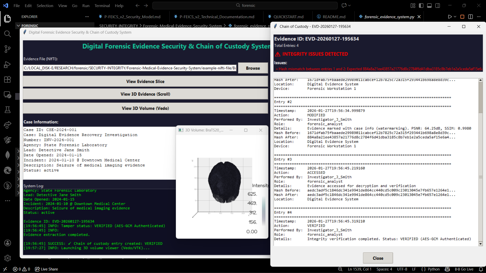
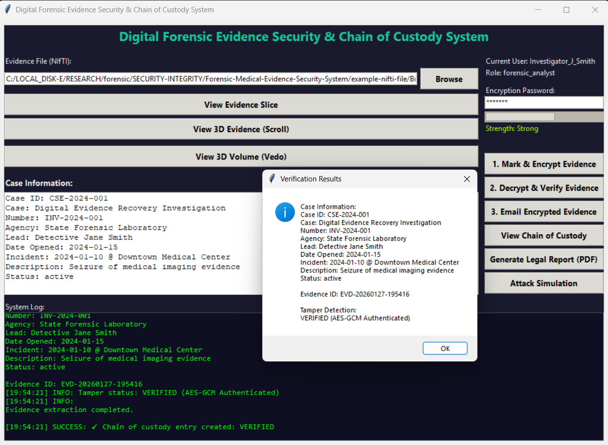

# 🧬 Digital Forensic Medical Evidence Security & Chain of Custody System

> **A forensic-grade system for securing, watermarking, encrypting, and preserving the integrity of medical imaging evidence with legally-defensible chain of custody.**

System Snapshot (Chain of Custody and 3D Volume Viewer):




---

## 📌 Abstract

This project implements a **Digital Forensic Medical Evidence Security and Integrity Preservation System** focused on **medical imaging evidence** (specifically NIfTI volumes).
It ensures **confidentiality, integrity, authenticity, and traceability** of evidence using:

* Cryptographic hashing (SHA-256)
* Authenticated encryption (AES-GCM)
* Steganographic watermarking (LSB-based)
* Immutable chain-of-custody logging
* Legal-grade PDF reporting

The system is designed as a **forensic research prototype**, suitable for academic study, demonstrations, and controlled laboratory environments — **not as a general-purpose file encryption tool**.

---

## 🎯 Motivation, Importance & Research Purpose

### Why this project matters

In forensic medicine and digital forensics:

* Medical scans (CT, MRI, fMRI) are **high-value evidence**
* Any **undocumented access or modification** can invalidate evidence in court
* Traditional storage systems **do not embed forensic context inside evidence itself**

This system addresses:

* **Evidence integrity**
* **Chain of custody transparency**
* **Tamper detection**
* **Court-admissible documentation**

### Research Scope

This project explores the intersection of:

* Digital forensics
* Medical imaging
* Cryptography
* Steganography
* Legal documentation

It serves as a **proof-of-concept forensic evidence handling system**, not a finished commercial product.

---

## 🏗️ System Overview

At a high level, the system performs:

```
Medical Evidence (NIfTI)
        ↓
SHA-256 Hashing
        ↓
Encrypted Case Info (AES-GCM)
        ↓
LSB Watermarking (Mid Slice)
        ↓
Encrypted Evidence Storage
        ↓
Immutable Chain of Custody
        ↓
Legal PDF Report
```

### Key Design Principle

> **Evidence should carry its forensic context within itself**, not just alongside it.

---

## 🧪 Supported Evidence Scope (Important)

✅ **Currently Supported**

* Medical imaging evidence:

  * NIfTI (`.nii`, `.nii.gz`)
  * 3D / volumetric scans
* Forensic medical use cases

❌ **Not Supported (Yet)**

* Arbitrary documents (PDF, DOCX, etc.)
* Generic file encryption workflows
* Cloud-based uploads

➡️ These are **explicitly future improvements**, not current features.

---

## ⚙️ Architecture & Modules

| Module                  | Purpose                            |
| ----------------------- | ---------------------------------- |
| `main.py`               | Core forensic system (GUI + logic) |
| ChainOfCustodyManager   | Immutable custody logging          |
| Cryptographic Utilities | Hashing, AES-GCM                   |
| Watermarking Engine     | LSB embedding in medical scans     |
| Quality Metrics         | PSNR & SSIM                        |
| PDF Generator           | Legal documentation                |
| Email Module            | Secure evidence transfer           |
| `tamper.py`             | Attack simulation tool             |

---

## 🔬 Methodology

### 1️⃣ Cryptographic Integrity (SHA-256)

Every evidence file is hashed:

```
H = SHA256(file_bytes)
```

Used for:

* Initial seizure verification
* Modification detection
* Chain-of-custody continuity

---

### 2️⃣ Authenticated Encryption (AES-GCM)

* AES key derived from password:

```
Key = SHA256(password)
```

* AES-GCM provides:

  * Confidentiality
  * Integrity
  * Authentication

Any modification → **decryption failure = tampering detected**

---

### 3️⃣ Steganographic Watermarking (LSB)

Encrypted case metadata is:

* Converted to bits
* Embedded in **LSB of mid axial slice**

This ensures:

* Minimal perceptual change
* Embedded forensic context
* Dual-layer integrity (file + watermark)

---

### 4️⃣ Image Quality Metrics

To ensure forensic validity:

* **PSNR** (Peak Signal-to-Noise Ratio)
* **SSIM** (Structural Similarity Index)

High values indicate:

* Watermark is **non-destructive**
* Diagnostic integrity preserved

---

### 5️⃣ Chain of Custody (Forensic Core)

Each action is logged as an **immutable entry**:

* Uploaded
* Modified
* Accessed
* Verified
* Transferred
* Exported

Integrity checks include:

* Timestamp ordering
* Hash continuity
* Unauthorized hash changes

---

## ✨ Features

* 🧾 Immutable chain-of-custody logging
* 🔐 AES-GCM encryption
* 🧬 Medical image watermarking
* 🧠 3D medical evidence visualization
* 🧪 Attack & tamper simulation
* 📄 Court-ready PDF reports
* 📧 Secure evidence transfer
* 👤 Role-based forensic actions

---

## 🖼️ Additional Screenshots

### 1️⃣ Main UI:



---

### 2️⃣ Tamper / Attack Simulation Tool


---

## 🧰 Installation & Prerequisites

### System Requirements

* Python 3.9+
* Windows / Linux
* Recommended RAM: 8GB+

### Required Libraries

```bash
pip install numpy opencv-python nibabel pycryptodome reportlab matplotlib vedo
```

---

## ▶️ How to Run

```bash
python main.py
```

For tamper simulation:

```bash
python tamper.py
```

---

## 🧨 Attack Simulation (`tamper.py`)

This tool:

* Simulates a **malicious bit-flip attack**
* Corrupts encrypted evidence
* Demonstrates detection via AES-GCM authentication failure

⚠️ **Educational & testing use only**

---

## 📄 Legal Report Generation

The system auto-generates:

* Case details
* Evidence metadata
* Full chain of custody
* Integrity verification
* Quality metrics

📌 Suitable for:

* Academic submission
* Mock court demonstrations
* Forensic documentation training

---

## ⚠️ Limitations & Incompleteness

* Prototype-level system
* No real user authentication
* No courtroom certification
* Single-slice watermarking
* Local file storage only
* GUI-based (not scalable backend)

---

## 🚀 Future Improvements

- [ ]  Multi-slice / volumetric watermarking
- [ ]  Support for DICOM
- [ ]  Secure cloud-backed storage
- [ ]  Real authentication & audit trails
- [ ]  General document evidence support
- [ ]  Blockchain-backed custody logs
- [ ]  Automated forensic validation scoring

---

## ⚖️ Ethical & Legal Considerations

* Not certified for real legal proceedings
* For research & educational use
* Must not replace certified forensic tools
* Requires expert interpretation

---

## 👤 Author & Credits

**Kartik Kashyap**<br>
Software Developer<br>
B.Tech Information Technology<br>
Criminology, Forensics, and Human-Centered AI Research Enthusiast<br>
Contact: [kartikkashyapworks247@gmail.com](mailto:kartikkashyapworks247@gmail.com)<br>

**Vaibhav Laxmi**<br>
Forensic & Criminology Domain Advisor<br>
B\.Sc. M\.Sc. Criminology & Forensic Science, NFSU<br>
Contact: [vaibhav.bsmscrfs2242925@nfsu.ac.in](mailto:vaibhav.bsmscrfs2242925@nfsu.ac.in)<br>


**Inspired by:**
* Digital Forensics principles
* Medical imaging security research
* Legal chain-of-custody standards

---

## 📜 License

**Academic / Research Use Only**

Permission is granted to:

* Study
* Modify
* Extend for academic purposes

Commercial or legal deployment requires further validation.