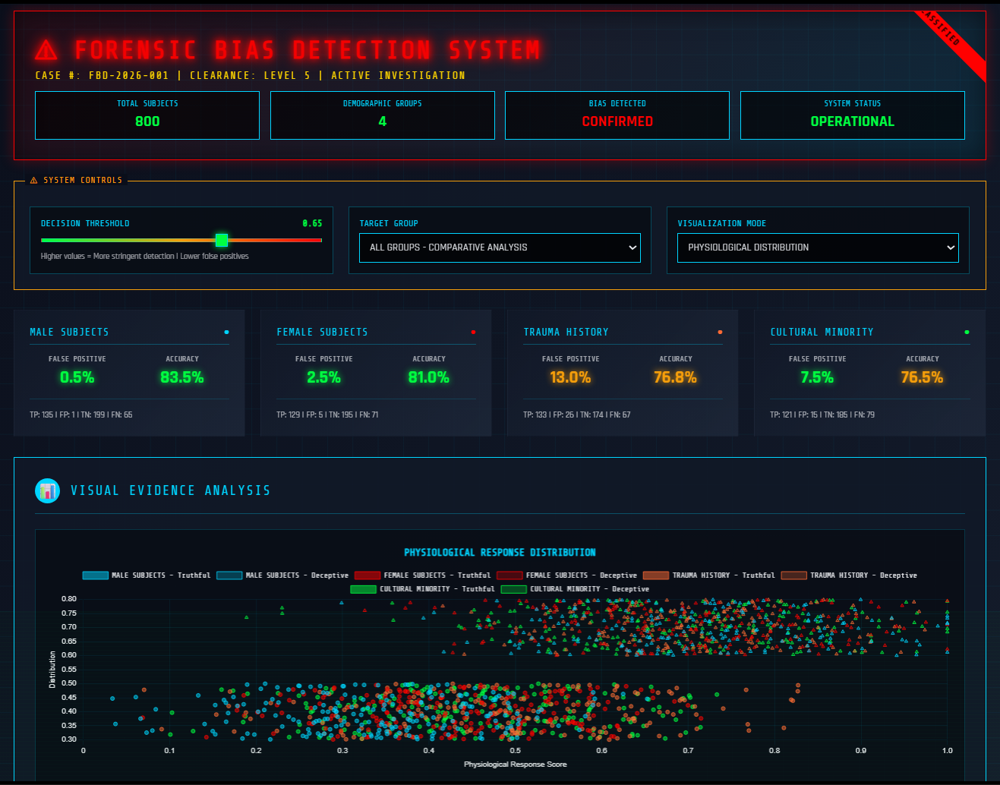

# FORENSIC BIAS DETECTION SYSTEM (FBD)

> **A simulation-based forensic tool for analyzing systematic bias in deception detection systems across demographic and psychological groups.**

⚠ **Classification:** Research / Educational
⚠ **Warning:** This system exposes ethical and statistical failures in deception detection practices. Findings may challenge existing forensic assumptions.



---

## Abstract

The **Forensic Bias Detection System (FBD)** is an interactive, browser-based simulator designed to **analyze, visualize, and explain demographic and psychological bias** in deception detection systems.

Using **synthetic physiological response data**, threshold-based decision modeling, and explainable statistical metrics, the system demonstrates how a *single global decision threshold* can produce **unequal false positive rates** across groups such as:

* Male vs female subjects
* Trauma survivors
* Cultural minority populations

An optional **local LLM integration (LLaMA 3.2 via Ollama)** provides expert-style forensic, ethical, and neurobiological interpretation of detected bias patterns.

This project is intended strictly for **research, education, and ethical analysis**, not operational forensic deployment.

---

## Motivation, Importance & Research Purpose

### Why this system exists

Deception detection technologies (polygraph-like systems, stress-based classifiers, physiological scoring models) are frequently criticized for:

* High false positive rates
* Poor cross-population validation
* Ethical harm to vulnerable groups
* Overconfidence in “objective” physiological signals

Yet many tools **do not visibly expose these biases**.

This simulator was built to:

* Make bias **measurable, visual, and unavoidable**
* Demonstrate why *accuracy alone* is insufficient
* Support ethical, victim-centered forensic education
* Encourage evidence-based reform or abandonment of biased tools

---

## Table of Contents

[TOC]

<!-- 1. System Overview
2. Scope and Intended Use
3. Architecture
4. Methodology
5. Statistical Metrics and Logic
6. Visualization Modes
7. AI-Assisted Forensic Analysis
8. Installation and Usage
9. Features
10. Limitations
11. Future Improvements (TODO)
12. Ethical Considerations
13. Credits
14. License -->

---

## System Overview

The system simulates deception detection decisions based on a **continuous physiological response score** ∈ [0, 1].

```
Physiological Signal Distribution
            ↓
Decision Threshold
            ↓
Truthful / Deceptive Classification
            ↓
Bias Metrics (FPR, FNR, Accuracy, Precision)
            ↓
Visualization + Ethical Interpretation
```

Bias is evaluated **across groups**, not individuals.

---

## Scope and Intended Use

### Included

* Bias analysis across demographic / psychological groups
* Threshold-based classification behavior
* Statistical visualization
* Ethical and forensic interpretation
* ROC and confusion matrix analysis

### Explicitly Excluded

* Real human data
* Individual deception prediction
* Operational interrogation use
* Law enforcement decision-making

This is a **simulation and analysis tool**, not a detector.

---

## Architecture

**Frontend-only system** (no backend server):

* `index.html` – UI layout and forensic interface
* `script.js` – Data generation, metrics, charts, AI integration
* `styles.css` – Thematic forensic styling
* Chart.js – Statistical visualization
* Ollama API (optional) – Local AI reasoning

All computations occur **client-side**.

---

## Methodology

### Synthetic Data Generation

Each group is modeled using **normal distributions** with group-specific parameters:

* Mean physiological response
* Standard deviation
* Separate distributions for:

  * Truthful states
  * Deceptive states

Values are clipped to `[0, 1]` to mimic bounded detector scores.

> This reflects *systemic tendencies*, not biological truth.

---

### Decision Threshold Logic

For a threshold **T**:

* Response ≥ T → Classified as *Deceptive*
* Response < T → Classified as *Truthful*

This produces:

* True Positives (TP)
* False Positives (FP)
* True Negatives (TN)
* False Negatives (FN)

---

## Statistical Metrics and Jargon

The system computes:

* **Accuracy**
* **False Positive Rate (FPR)**
* **False Negative Rate (FNR)**
* **Precision**
* **Recall**

Key forensic insight:

> **High accuracy can coexist with severe injustice** when FPR differs across groups.

---

## Visualization Modes

### 1. Physiological Distribution (Scatter)

* Overlapping truthful vs deceptive responses
* Threshold line visualization
* Reveals distribution overlap problems

### 2. Bias Comparison (Bar Chart)

* FPR vs Accuracy per group
* Highlights disparity masked by accuracy

### 3. ROC Curve

* Performance across all thresholds
* Shows impossibility of a “fair” global threshold

### 4. Confusion Matrix

* Concrete error counts
* Victim-centered interpretation (who gets harmed)

---

## AI-Assisted Forensic Analysis (Optional)

If **Ollama + LLaMA 3.2** is running locally, the system enables:

* Expert-style bias interpretation
* Ethical analysis
* Neurobiological explanations
* Reform recommendations
* Auto-generated forensic reports

AI **does not compute metrics** — it only interprets them.

---

## Installation and Usage

### Prerequisites

* Modern web browser
* Optional: Ollama installed locally

### Run

```bash
open index.html
```

### Enable AI Analysis (Optional)

```bash
ollama pull llama3.2
ollama run llama3.2
```

Ensure Ollama is accessible at:

```
http://localhost:11434
```

---

## Features

* Interactive bias simulation
* Multi-group comparative analysis
* Threshold sensitivity exploration
* ROC and confusion matrix analysis
* Local AI forensic expert
* Ethical framing by design
* No data storage, no tracking

---

## Limitations

* Uses synthetic data only
* Simplified statistical modeling
* Not calibrated to real instruments
* No longitudinal modeling
* No legal or clinical validation
* Browser-only prototype

---

## Future Improvements

* [ ] Integrate real, anonymized benchmark datasets
* [ ] Add confidence intervals and uncertainty visualization
* [ ] Implement group-specific calibration experiments
* [ ] Add longitudinal stress modeling
* [ ] Export reports as signed PDF evidence briefs
* [ ] Add academic citation overlays
* [ ] Integrate GIS or contextual interrogation variables

---

## Ethical Considerations

* Designed to **expose harm**, not enable interrogation
* Avoids individual profiling
* Centers false positives as ethical failure
* Highlights trauma-informed forensic risks
* Encourages restraint or abolition of biased tools

---

## Credits

**Kartik Kashyap**<br>
Software Developer<br>
B.Tech Information Technology<br>
Criminology, Forensics, and Human-Centered AI Research Enthusiast<br>
Contact: [kartikkashyapworks247@gmail.com](mailto:kartikkashyapworks247@gmail.com)<br>

**Vaibhav Laxmi**<br>
Forensic & Criminology Domain Advisor<br>
B\.Sc. M\.Sc. Criminology & Forensic Science, NFSU<br>
Contact: [vaibhav.bsmscrfs2242925@nfsu.ac.in](mailto:vaibhav.bsmscrfs2242925@nfsu.ac.in)<br>

---

## License

**Academic & Educational Use License**

This project may be:

* Studied
* Modified
* Used for coursework and research

Operational, commercial, or investigative use requires **independent ethical and scientific validation**.