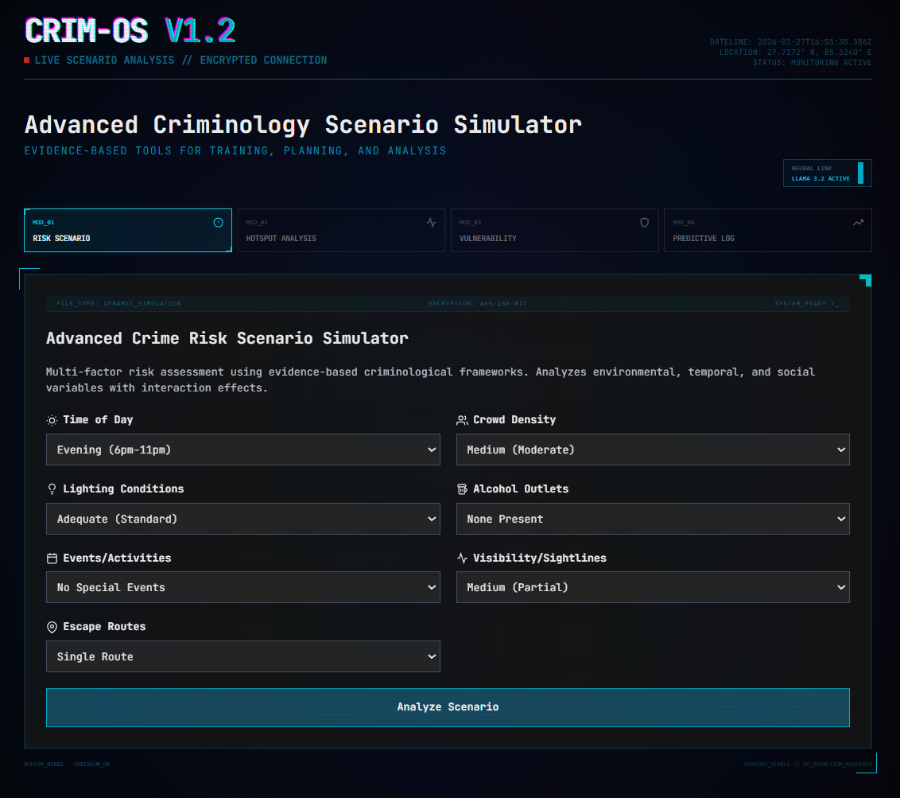

# CRIM-OS: Advanced Criminology Scenario Simulator

**CRIM-OS (Criminology Operations Simulator)** is an interactive, browser-based criminology simulation suite designed for **crime risk assessment, hotspot analysis, environmental vulnerability auditing, and simplified predictive modeling**.

It integrates **criminological theory, rule-based modeling, and optional local LLM insights (via Ollama + LLaMA 3.2)** to support learning, scenario analysis, and policy experimentation.




> This system is intended for **educational, research, and training purposes**, not operational law enforcement deployment.

---

## Table of Contents

[TOC]

<!-- 1. Overview
2. Motivation and Research Purpose
3. System Architecture
4. Core Modules

   * Risk Scenario Simulator
   * Hotspot Analysis Simulator
   * Vulnerability Assessment Simulator
   * Predictive Modeling Simulator
5. Methodology and Theoretical Foundations
6. Scoring Models and Logic
7. AI Integration (Ollama + LLaMA)
8. Tech Stack
9. Installation and Running Instructions
10. Features
11. Limitations and Incompleteness
12. Future Improvements
13. Ethical and Legal Considerations
14. Credits
15. License -->

---

## 1. Overview

CRIM-OS provides a **modular criminology simulation environment** where users can manipulate environmental, social, and temporal variables to observe:

* Changes in crime risk
* Hotspot intensity redistribution
* Environmental vulnerability patterns
* Long-term crime trend forecasts

The system emphasizes **explainability** over black-box prediction and explicitly links outcomes to **established criminological theories**.

---

## 2. Motivation and Research Purpose

### Why this project exists

Many criminology tools fall into one of two extremes:

* Static theory-heavy explanations with no experimentation
* Black-box “AI crime prediction” tools with poor transparency

CRIM-OS aims to fill the gap by:

* Translating criminological theory into **interactive, inspectable models**
* Allowing **what-if analysis** for planning and training
* Demonstrating **how environmental and social factors interact**, rather than predicting individual behavior

### Intended use cases

* Criminology and forensic science education
* Urban safety and CPTED training
* Policy scenario testing (non-operational)
* Demonstrations of theory-informed modeling
* Human–AI decision-support research (with local LLMs)

---

## 3. System Architecture

The system is implemented as a **single-page React application**, rendered directly in the browser.

High-level flow:

```
User Inputs (Scenarios / Sliders / Selectors)
            ↓
Rule-Based & Weighted Scoring Models
            ↓
Theory-Aware Interpretation Layer
            ↓
Optional LLM-Based Expert Commentary
```

There is **no backend server**; all logic runs client-side, except optional calls to a **local Ollama API**.

---

## 4. Core Modules

### 4.1 Risk Scenario Simulator

Evaluates situational crime risk using:

* Time of day
* Crowd density
* Lighting conditions
* Alcohol outlet presence
* Events
* Visibility
* Escape routes

Outputs:

* Composite risk score (0–100)
* Factor-wise breakdown
* Risk classification (Low / Moderate / Elevated)
* Theory-grounded explanation
* Optional AI expert analysis

---

### 4.2 Hotspot Analysis Simulator

Simulates crime intensity across common urban zone types:

* Entertainment districts
* Transit hubs
* Residential areas
* Commercial centers
* Parks and industrial zones

Users can manipulate:

* Lighting quality
* Patrol frequency
* Alcohol outlet density
* CCTV coverage
* Social cohesion

Includes:

* Current-state hotspot distribution
* Optimized intervention comparison
* Displacement-aware reasoning

---

### 4.3 Vulnerability Assessment Simulator

Focuses on **victim-side and environmental vulnerability**, not offender profiling.

Evaluates:

* Temporal exposure patterns
* Lighting quality
* Crowd density
* Perceived safety
* Accessibility
* Signage
* Maintenance

Outputs:

* Overall vulnerability score
* Zone-wise vulnerability mapping
* CPTED-aligned recommendations
* Explicit theory annotations

---

### 4.4 Predictive Modeling Simulator

Provides a **simplified, transparent forecasting model** based on:

* Historical crime rate
* Socioeconomic stress indicators
* Youth population density
* Seasonal effects
* Intervention scenarios

Outputs:

* Predicted crime rate
* Confidence interval (illustrative)
* Month-wise trend projection
* Driver analysis and model insights

> This module demonstrates *how prediction logic works*, not real-world accuracy.

---

## 5. Methodology and Theoretical Foundations

The system explicitly draws from:

* **Routine Activity Theory**
  (Motivated offender × Suitable target × Absence of guardianship)

* **Crime Prevention Through Environmental Design (CPTED)**
  (Natural surveillance, access control, territorial reinforcement)

* **Broken Windows Theory**
  (Disorder as a signal of low guardianship)

* **Environmental Criminology**

* **Age–Crime Curve**

Each output is accompanied by **theory-consistent explanations**, not raw scores alone.

---

## 6. Scoring Models and Logic

### Risk scoring

Risk scores are computed using:

* Weighted factor contributions
* Explicit interaction effects (e.g., late night + poor lighting)
* Capped normalization to prevent runaway values

Example (conceptual):

```
Total Risk =
  Temporal Risk +
  Environmental Risk +
  Social Risk +
  Substance Risk +
  Interaction Effects
```

### Important note

These models are:

* Deterministic
* Explainable
* Designed for learning and comparison

They are **not trained machine learning models**.

---

## 7. AI Integration (Ollama + LLaMA)

CRIM-OS optionally connects to a **local Ollama instance**:

* Model: `llama3.2`
* Endpoint: `http://localhost:11434`

The LLM is used only for:

* High-level expert-style interpretation
* Recommendations
* Theory selection

The AI **does not generate scores**, only commentary.

If Ollama is offline, the system remains fully functional.

---

## 8. Tech Stack

* HTML5
* React 18 (UMD build)
* Tailwind CSS
* Babel (in-browser)
* Ollama (optional, local)
* LLaMA 3.2 (local inference)

No database. No cloud services.

---

## 9. Installation and Running Instructions

### Prerequisites

* Modern web browser (Chrome, Edge, Firefox)
* Optional: Ollama installed and running locally

### Running the app

Simply open the HTML file:

```bash
open index.html
```

or

```bash
double-click index.html
```

### Enabling AI insights (optional)

```bash
ollama run llama3.2
```

Ensure Ollama is available at:

```
http://localhost:11434
```

---

## 10. Features

* Modular criminology simulators
* Theory-aligned explanations
* Transparent scoring logic
* Interactive what-if analysis
* Local AI expert commentary
* No data collection
* No cloud dependency

---

## 11. Limitations and Incompleteness

* Uses synthetic and assumed data
* No real crime datasets
* No spatial GIS mapping
* No individual-level prediction
* No machine learning training
* Browser-only, non-scalable architecture

This is a **research and teaching prototype**, not a deployment-ready system.

---

## 12. Future Improvements

- [ ]  Integration with real GIS datasets (QGIS / GeoJSON)
- [ ]  Agent-based simulation
- [ ]  Empirical calibration using real crime data
- [ ]  Scenario export and reporting
- [ ]  Multi-user classroom mode
- [ ]  Research-grade validation metrics

---

## 13. Ethical and Legal Considerations

* Not suitable for predictive policing
* Not admissible for legal decisions
* Avoids individual profiling by design
* Focuses on environment, not people
* Intended to support prevention and planning, not enforcement bias

---

## 14. Credits

**Kartik Kashyap**<br>
Software Developer<br>
B.Tech Information Technology<br>
Criminology, Forensics, and Human-Centered AI Research Enthusiast<br>
Contact: kartikkashyapworks247@gmail.com<br>


**Vaibhav Laxmi**<br>
Forensic & Criminology Domain Advisor<br>
B\.Sc. M\.Sc. Criminology & Forensic Science, NFSU<br>
Contact: vaibhav.bsmscrfs2242925@nfsu.ac.in<br>


**Conceptual inspiration:**

* Environmental criminology literature
* CPTED frameworks
* Crime analysis pedagogy

---

## 15. License

**Academic and Educational Use License**

You may:

* Study
* Modify
* Extend
* Use for coursework or research demonstrations

Commercial or operational use requires independent validation and ethical review.